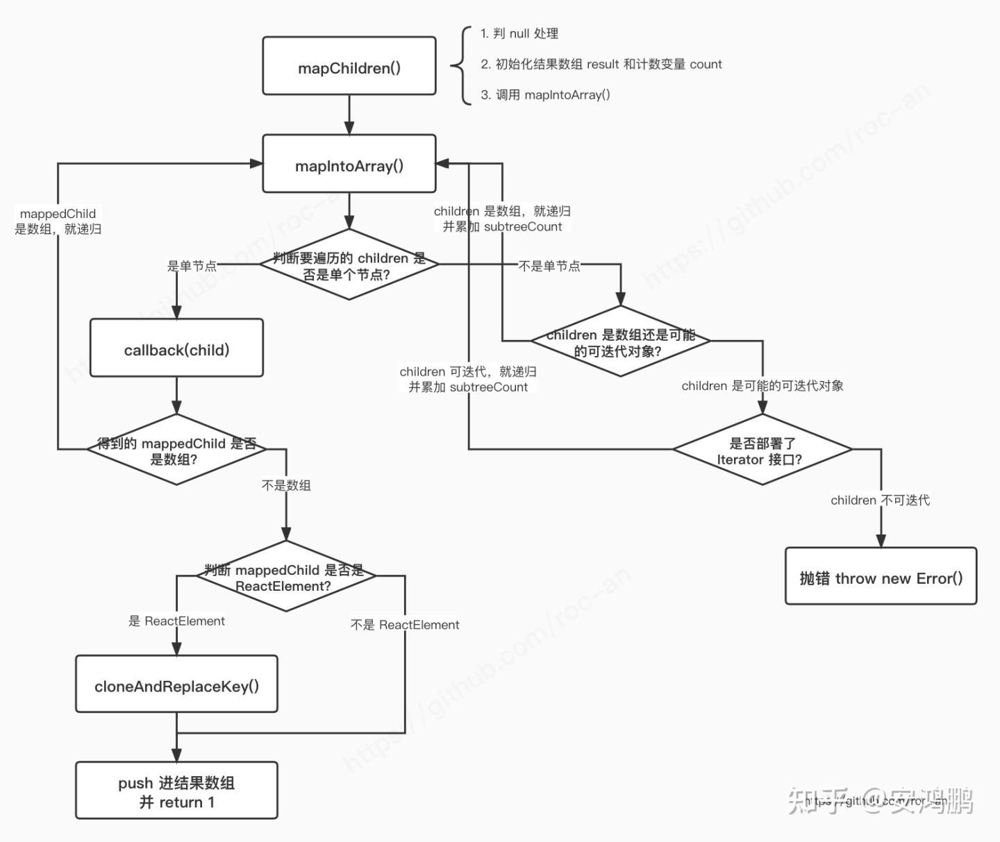

# React Children源码：

## React.Children:

React.Childre目前提供了5个api，分别是forEach, map, count, toArray, only：

- `React.Children.map(children, function[(thisArg)])`：类似数组的 `map` 方法，遍历 `children` 的每个直接子节点，调用传入的函数，最终得到一个新数组；
- `React.Children.forEach(children, function[(thisArg)])`：类似数组的 `forEach` 方法，与 `React.Children.map()` 类似，只是没有返回值；
- `React.Children.count(children)`：得到 `children` 中子节点（也包括子节点的子节点们，也就是子节点树）的总数量；
- `React.Children.only(children)`：验证 `children` 是否只有 1 个子节点，是的话就返回这个节点，不是的话抛错；
- `React.Children.toArray(children)`：将 `children` 展开为一维数组并返回。

本文会对它们的源码进行剖析，除此之外，过程中还能学到：

- 如何用**双层递归**来展开节点子树；
- 节点的 `key` 是如何设置的；
- 如何用 36 进制数优化 `key` 的字符数（这是**多进制数**在编程中的一个常见场景）；
- `Iterator` 可迭代对象的使用。

## React.Children.map:

几个核心的api中最重要的就是React.Children.map，其他几个都是围绕map来展开的，所以掌握了map的逻辑，其他四个也就简单了。

map会将其所有关联子节点“铺平”，用map之后，你得到的永远是一个字节点的一维数组，不存在什么嵌套结构。

### React.Children.map源码:

在react.js文件下可以找到暴露出来的Children

```js
import {forEach, map, count, toArray, only} from './ReactChildren';
...
export {
  Children,
  createMutableSource,
  ...
}
```

然后在ReactChildren.js文件下可以发现map就是文件下的mapChildren函数：

```js
export {
  forEachChildren as forEach,
  mapChildren as map,
  countChildren as count,
  onlyChild as only,
  toArray,
};
```

mapChildren函数则只是对传入的children做了层null的判断，主要逻辑在**mapIntoArray**这个函数里，所有的参数都透传到给了**mapIntoArray**

```js
function mapChildren(
  children: ?ReactNodeList,
  func: MapFunc,
  context: mixed,
): ?Array<React$Node> {
  if (children == null) {
    return children;
  }
  const result = [];
  let count = 0;
  mapIntoArray(children, result, '', '', function(child) {
    return func.call(context, child, count++);
  });
  return result;
}
```

#### mapIntoArray函数：

##### 先来看下mapIntoArray的入参：

escapedPrefix 和 nameSoFar暂时还不清楚他们的作用，根据关键字Prefix和string类型来看应该是处理后的字符串，其实他们是用于递归中命名key的

```js
function mapIntoArray(
  children: ?ReactNodeList, // 要遍历的子节点数
  array: Array<React$Node>, // 遍历后的子节点树
  escapedPrefix: string,
  nameSoFar: string,
  callback: (?React$Node) => ?ReactNodeList, // 给当前节点遍历的回调函数
): number {
...
}
```

##### 判断children是否是单个字节点：

```js
const type = typeof children; // 先拿到children类型

  if (type === 'undefined' || type === 'boolean') { // 以上类型children都视为null
    children = null;
  }

  let invokeCallback = false; // 判断是否调用callback
  /*
  * 如果children的类型是 undefined | string | number
  * 或者children是单节点，且其$$typeof属于 REACT_ELEMENT_TYPE | REACT_PORTAL_TYPE
  * 他们都是可渲染节点，invokeCallback置为true
  * */
  if (children === null) {
    invokeCallback = true;
  } else {
    switch (type) {
      case 'string':
      case 'number':
        invokeCallback = true;
        break;
      case 'object':
        switch ((children: any).$$typeof) {
          case REACT_ELEMENT_TYPE:
          case REACT_PORTAL_TYPE:
            invokeCallback = true;
        }
    }
  }
```

- 首先建立了invokeCallback变量，通过字义可以知道这是用来判断是否回调的标识符。
- 经过一系列``if、switch``来判断节点是否是可渲染单节点
- REACT_ELEMENT_TYPE 和 REACT_PORTAL_TYPE 就把它视为两种节点类型

##### 对单个节点直接调用callback:

```js
 // 如果invokeCallback为true进行判断
 if (invokeCallback) {
    const child = children;
    let mappedChild = callback(child);
    // 即使只有一个子节点，也会被包裹进数组中去进行命名
    // 这样其实后续子节点数量增多了也能使前后保持一致
    const childKey =
      nameSoFar === '' ? SEPARATOR + getElementKey(child, 0) : nameSoFar; // 初始化子节点key
    if (isArray(mappedChild)) {
      // 如果调用map函数得到的子节点是一个数组，则编码好key前缀，继续调用mapIntoArray遍历
      // 这一步保证children数组是一维的
      let escapedChildKey = '';
      if (childKey != null) {
        escapedChildKey = escapeUserProvidedKey(childKey) + '/';
      }
      mapIntoArray(mappedChild, array, escapedChildKey, '', c => c);
    } else if (mappedChild != null) {
      // 调用map得到的子节点不是数组，验证该节点是否是ReactElement
      // A、如果是ReactElement，则clone Element，并替换key，然后push进数组
      // B、如果不是ReactElement，直接push进数组
      if (isValidElement(mappedChild)) {
        mappedChild = cloneAndReplaceKey(
          mappedChild,
          // 如果递归前的key和递归后的key不同，则保留两者
          // 将之前递归时的key前缀 拼接上 本次递归生成的key
          escapedPrefix +
            // React.Portal 不存在 key 的情况
            (mappedChild.key && (!child || child.key !== mappedChild.key)
              ? // 节点的 key 可能是 number 的情况
                escapeUserProvidedKey('' + mappedChild.key) + '/'
              : '') +
            childKey,
        );
      }
      array.push(mappedChild);
    }
    return 1; // 子节点为单节点，返回个数1
  }
```

代码中，判断如果 `invokeCallback` 为 `true`，那么通过 `let mappedChild = callback(child);` 对单个子节点直接调用了 `callback`，得到 `map` 后的返回值 `mappedChild`。

得到的 `mappedChild` 主要有两种情况：

- 是个数组；
- 不是 `null` 也不是数组：
- 是单个有效的 ReactElement 对象；
- 是单个其它值。

如果``mappedChild``是个数组，则递归调用``mapIntoArray``

```js
mapIntoArray(mappedChild, array, escapedChildKey, '', c => c)
```

这里看到回调函数直接处理成返回自己，防止继续递归下去。

``isValidElement``判断是否是ReactElement对象

- 如果是，替换key值后push进数组
- 如果不是直接push

``isValidElement``如何对节点进行判断的呢？其实判断节点是否是一个ReactElement主要看其$$typeof属性是否是REACT_ELEMENT_TYPE（0xeac7）。

```js
export function isValidElement(object) {
  return (
    typeof object === 'object' &&
    object !== null &&
    object.$$typeof === REACT_ELEMENT_TYPE
  );
}
```

之后``cloneAndReplaceKey``克隆节点并附上新的key。

最后记得return 1，因为map函数的返回值是**所有子节点数**。

##### 对多个节点进行map：

```js
// 如果invokeCallback为false，则children不是单节点，需要对其进行遍历
let child;
  let nextName;
  let subtreeCount = 0; // 当前子节点数的节点数
  const nextNamePrefix =
    nameSoFar === '' ? SEPARATOR : nameSoFar + SUBSEPARATOR;

  if (isArray(children)) {
    ...
  } else {
    ...
  }
```

观察if else判读，可以知道当children为多节点状态的时候可能有两种情况

- 是个数组
- 是个可迭代对象（部署了 `Iterator` 接口，也就是对象上有 `iteratorFn` 函数）
- 是个object，但是没有`iteratorFn` 函数，也就是不可迭代对象，报错

##### children是数组的情况：

```js
if (isArray(children)) {
    for (let i = 0; i < children.length; i++) {
      child = children[i];
      nextName = nextNamePrefix + getElementKey(child, i);
      subtreeCount += mapIntoArray(
        child,
        array,
        escapedPrefix,
        nextName,
        callback,
      );
    }
  }
```

数组情况很简单，其实就是对children进行遍历。因为``mapIntoArray``会返回所有子节点数，所以利用递归累加``mapIntoArray()``算出来``subtreeCount``子节点个数，从而通过递归实现对整个子树的遍历。

需要注意的是，这里判断``children``是否是数组，并不是通过``callback``处理后的结果进行判断的，前者回去判断要遍历的``children``，后者会对callback后的结果进行判断。

##### children是可迭代对象的情况：

```js
 if (isArray(children)) {
   ...
 } else {
    const iteratorFn = getIteratorFn(children);
    // 如果children是有iterator的对象
    if (typeof iteratorFn === 'function') {
      const iterableChildren: Iterable<React$Node> & {
        entries: any,
      } = (children: any);

      if (__DEV__) {
        ...
      }

      const iterator = iteratorFn.call(iterableChildren);
      let step;
      let ii = 0;
      // 用while循环来迭代children对象，通过iterator.next()来获取下一个对象，知道对象的done属性为true结束遍历
      while (!(step = iterator.next()).done) {
        child = step.value;
        nextName = nextNamePrefix + getElementKey(child, ii++);
        subtreeCount += mapIntoArray(
          child,
          array,
          escapedPrefix,
          nextName,
          callback,
        );
      }
    } 
} else if (type === 'object') {
      // 对象不存在iterator接口，无法迭代，则报错
      const childrenString = '' + (children: any);
      invariant(
        false,
        'Objects are not valid as a React child (found: %s). ' +
          'If you meant to render a collection of children, use an array ' +
          'instead.',
        childrenString === '[object Object]'
          ? 'object with keys {' + Object.keys((children: any)).join(', ') + '}'
          : childrenString,
      );
}
```

代码中，先通过 `getIteratorFn()` 函数来尝试获取 `children` 的 `Iterator` 函数。`getIteratorFn()` 的源码：

```js
// packages/shared/ReactSymbols.js
const MAYBE_ITERATOR_SYMBOL = typeof Symbol === 'function' && Symbol.iterator;
const FAUX_ITERATOR_SYMBOL = '@@iterator';

export function getIteratorFn(maybeIterable: ?any): ?() => ?Iterator<*> {
  // 如果对象是null或非对象，直接返回
  if (maybeIterable === null || typeof maybeIterable !== 'object') {
    return null;
  }
  // 判断对象是否存在iterator接口，通过是否存在Symbol.iterator来判断是否是可迭代对象
  const maybeIterator =
    (MAYBE_ITERATOR_SYMBOL && maybeIterable[MAYBE_ITERATOR_SYMBOL]) ||
    maybeIterable[FAUX_ITERATOR_SYMBOL];
// 判断其是否是个函数
  if (typeof maybeIterator === 'function') {
    return maybeIterator;
  }
  return null;
}
```

``iteratorFn``拿到迭代函数，然后用迭代函数来迭代``children``，如果是个迭代对象，那就需要用while循环来遍历了。

``iterator``对象每个元素包含``value``和``done``，``done``是``true``表示迭代到最后一个元素。``next()``来获取迭代对象中的下一个元素。

``step``和``ii``都是临时变量，每次迭代结果赋给``step``，每迭代一个元素ii加一。

其内部遍历逻辑其实和``children``是数组的情况差不多，通过递归来遍历到每个子节点，获取到最终子节点个数subtreeCount

```
return subtreeCount;
```

最后``return subtreeCount;``，这200多行的React.Children.map源码就结束了。

### React.Children.map源码思路总结：



其中进行了两次关键的判断：

1. 判断要遍历的 `children` 是单个节点、数组还是可迭代对象；
2. 判断 `map` 得到的 `mappedChild` 是数组、`ReactElement` 还是其他值。

只要判断结果是数组或是可迭代对象，那就应递归调用 `mapIntoArray()` 去继续遍历，直到是一个单节点为止。

### 要点：如何设置key：

作为每个节点的唯一标识符key，肯定不能重复，每次对节点数进行一层的递归遍历，都会在key拼上 **“.”**、**“/”**、 **“:”** 其中的符号。

示例中，`<PlayChildren>` 有两个子节点 `<span>A</span>` 和 `<span>B</span>`：

```html
<PlayChildren>
  <span>A</span>
  <span>B</span>
</PlayChildren>
```

处理 `props.children` 时对每个子节点又 `return` 了数组：

```js
const playedChildren = React.Children.map(props.children, (c) => [c, [c, c]]);
```

最终渲染的结构是：

```html
<div id="root">
  <span>A</span>
  <span>A</span>
  <span>A</span>
  <span>B</span>
  <span>B</span>
  <span>B</span>
</div>
```

我把这 6 个子节点的 `key` 打印出来：

1. `{ key: ".0/.0" }`
2. `{ key: ".0/.1:0" }`
3. `{ key: ".0/.1:1" }`
4. `{ key: ".1/.0" }`
5. `{ key: ".1/.1:0" }`
6. `{ key: ".1/.1:1" }`

我们分析下 `key` 相关源码。首先，React 定义了两个分隔符：

```
// packages/react/src/ReactChildren.js
const SEPARATOR = '.'; // 用于命名节点 key 的分隔符
const SUBSEPARATOR = ':';// 用于命名节点 key 的子分隔符
```

#### 第一层key：

```js
let child;
let nextName;
let subtreeCount = 0; // Count of children found in the current subtree.
const nextNamePrefix =
  nameSoFar === '' ? SEPARATOR : nameSoFar + SUBSEPARATOR;

if (isArray(children)) {
  for (let i = 0; i < children.length; i++) {
    child = children[i];
    nextName = nextNamePrefix + getElementKey(child, i);
    subtreeCount += mapIntoArray(
      child,
      array,
      escapedPrefix,
      nextName,
      callback,
    );
  }
}
```

一开始，在``mapChildren``中是这么调用``mapIntoArray``的：

```js
mapIntoArray(children, result, '', '', function(child) {
  return func.call(context, child, count++);
});
```

可以看到escapedPrefix， nameSoFar初试都空字符串是“ ”，所以源码中 `nextNamePrefix` 初始是 `SEPARATOR`，也就是 `"."`。

之后拼接了 `getElementKey(child, i)`

```js
// 生成用于标识一组中元素的key
function getElementKey(element: any, index: number): string {
  // 这里要做一些类型检查，因为我们是在逐渐摸索地去调用它，确保不会阻碍未来潜在的 ES API。
  // 如果元素手动设置了 key，那么直接返回编码后的 key
  if (typeof element === 'object' && element !== null && element.key != null) {
    // Explicit key
    return escape('' + element.key);
  }
  // 如果未手动设置 key，那么这种隐式的 key 由它在一组中所处的索引决定
  // 用 36 进制字符串来表示索引，大于 9 的数字用字母 a~z 表示
  return index.toString(36);
}
```

我们没有手动去设置 `key`，所以 React 就会用节点索引来生成 `key`。这里有个小技巧，源码使用了 `index.toString(36)`。

36进制下一个字符位可以表示0-9a-z36个字符，这样就可以很有效的缩短字符串长度。

示例第一层传入的节点索引分别是 0 和 1，0 和 1 都小于 9，那么 `toString(36)` 后得到 `"0"` 和 `"1"`。

我们把示例第一层的 `key` 分析完，

```js
nextName = nextNamePrefix + getElementKey(child, i);
```

其中，`nextNamePrefix` 分析过了，是 `"."`，调用 `getElementKey(child, i)` 后分别是 `"0"` 和 `"1"`。

所以，最终第一层的 `key` 是 `".0"` 和 `".1"`，与打印结果的一致。

#### 第二层 key：

第一层的 `key` 设置好后，它作为下一层调用 `mapIntoArray()` 的 `nameSoFar` 参数。

在第二层中，`<span>` 作为单个 `ReactElement` 作为 `children` 传递给了 `mapIntoArray()`。这会命中单节点直接调用 `callback` 的条件分支：

```js
if (invokeCallback) {
  const child = children;
  let mappedChild = callback(child);
  // If it's the only child, treat the name as if it was wrapped in an array
  // so that it's consistent if the number of children grows:
  // 即便只有一个子节点，也会被当做包裹进一个数组中去命名。因为如果后续子节点的数量增加了，也能前后保持一致
  // 初始化子节点 key 的命名
  const childKey =
    nameSoFar === '' ? SEPARATOR + getElementKey(child, 0) : nameSoFar;
  if (isArray(mappedChild)) {
    // 如果调用 map 函数得到的子节点是数组，就编码好 key 前缀，然后递归进行 mapIntoArray()
    // 这一步确保了遍历的结果数组是一维的
    let escapedChildKey = '';
    if (childKey != null) {
      escapedChildKey = escapeUserProvidedKey(childKey) + '/';
    }
    mapIntoArray(mappedChild, array, escapedChildKey, '', c => c);
  } else if (mappedChild != null) {
    // ...
  }
}
```

这次 `nameSoFar` 已经有值了（分别是 `".0"` 和 `".1"`），因此这层得到的 `childKey` 是 `".0"` 和 `".1"`。

由于示例的 `map` 函数是 `(c) => [c, [c, c]]`，因此 `mappedChild` 是个数组。继而：

```js
escapedChildKey = escapeUserProvidedKey(childKey) + '/';
```

`escapeUserProvidedKey()` 函数的源码也很简单：

```js
const userProvidedKeyEscapeRegex = /\/+/g; // 全局匹配 1 个或多个 /
function escapeUserProvidedKey(text: string): string {
  // 将匹配到的 1 个或多个 / 替换成 $&/
  return text.replace(userProvidedKeyEscapeRegex, '$&/');
}
```

目前传入的 `childKey` 中没有 `/`，所以不会匹配到正则，还是原封不动地返回。那么最终 `escapedChildKey` 的值分别是：

- `".0/"`
- `".1/"`

接着 `escapedChildKey` 作为 `mapIntoArray()` 的第 3 个参数 `escapedPrefix` 传入，且参数 `nameSoFar` 传入了 `''`。

##### 在后续的递归中处理 key

接着，把 `[c, [c, c]]` 作为 `children` 传入 `mapIntoArray()`，这又成了 `children` 是数组的情况。

再继续递归，就成了 `children` 是 `c` 和 `[c, c]` 的情况，这块有点绕，不过如果耐心去理的话是可以理出来的。

对于 `children` 是 `c` 的情况，也就是此时是个单 `ReactElement` 节点了，那么会触发 `if (isValidElement(mappedChild)) {}` 的条件分支：

```js
if (isValidElement(mappedChild)) {
  mappedChild = cloneAndReplaceKey(
    mappedChild,
    // Keep both the (mapped) and old keys if they differ, just as
    // traverseAllChildren used to do for objects as children
    // 如果 map 前后节点的 key 不同，那么都将保留
    // 用之前递归过程中的 key 前缀拼接本次 map 的节点的 key
    escapedPrefix +
      // $FlowFixMe Flow incorrectly thinks React.Portal doesn't have a key
      // $FlowFixMe Flow 错误的认为 React.Portal 没有 key
      // 这里三目判断条件是：是否是 “map 后的 child 有 key，且与 map 前不同”
      (mappedChild.key && (!child || child.key !== mappedChild.key)
        ? // $FlowFixMe Flow incorrectly thinks existing element's key can be a number
          // $FlowFixMe Flow 错误地认为元素的 key 可以是数字
          // eslint-disable-next-line react-internal/safe-string-coercion
          escapeUserProvidedKey('' + mappedChild.key) + '/'
        : '') +
      childKey,
  );
}
```

> PS：注释中的 `$FlowFixMe` 应该是 FaceBook（后面就叫 Meta 了）React 程序员在向 `Flow` 程序员求助，看来 `Flow` 坑确实多啊。不用 TS 那是因为 TS 是微软的，而 Flow 是 Meta 自家的 :)

要注意，我们一直是通过向 `mapIntoArray()` 函数传入 `escapedPrefix` 和 `nameSoFar` 来拼接 `key` 的，所以此时 `mappedChild` 上没有 `key` 属性。

这里的 `(mappedChild.key && (!child || child.key !== mappedChild.key)` 是为了处理 `map` 前节点本身已经有 `key` 的情况。

至此，我们 `clone` 时为节点附上的新 `key` 分是：

- `".0/.0"`
- `".1/.0"`

而：

- `".0/.1"`
- `".1/.1"`

这两种情况，递归还没结束，别忘了我们还有一层 `children` 是 `[c, c]` 的情况...

感觉头发不知不觉又掉了一搓。

接着脑补，其实 `[c, c]` 在递归中又会命中 `children` 是数组的情况，然后继续递归，又会命中 `children` 是单节点的情况，那就拼呗：

- `".0/.1"` 被继续拼成了分别是：
- `".0/.1.0"`
- `".0/.1.1"`
- `".1/.1"` 被继续拼成了分别是：
- `".1/.1.0"`
- `".1/.1.1"`

我本以为大功告成了，但是发现上面浏览器打印的 `key` 中有冒号 `:`。当时我的内心是崩溃的。在 `ReactChildren.js` 中又找了几圈，还是没发现递归流程中 `key` 会有 `:` 的情况。

不过也没关系，我们的层级是正确的，而且，目前仅处于渲染的 `react` 模块这个阶段，还没有到后面实际渲染的 `react-dom` 阶段，从 `ReactChildren.js` 提供的其他编码 `key` 的函数来看，很可能后续阶段还会继续处理 `key`。

至此，所有递归情况下设置 `key` 的逻辑就分析完了。

可能有点蒙，不过很正常，关键是吸收它的**思想：提前设置好分隔符，然后在每层递归中，传递了之前分析好的 `key`，这样就能在后续递归中进行拼接。另外 React 还注意了手动为节点设置 `key` 的情况，并且使用了 36 进制数进行短字符优化，这些才是我们分析了一通的精髓**。

## 其他React.Childrena Api:

### React.Children.forEach():

```js
function forEachChildren(
  children: ?ReactNodeList,
  forEachFunc: ForEachFunc,
  forEachContext: mixed,
): void {
  mapChildren(
    children,
    function() {
      forEachFunc.apply(this, arguments);
      // Don't return anything.
    },
    forEachContext,
  );
}
```

``React.Children.forEach()``其实就是内部调用了``mapChildren``

### React.Children.count():

```js
function countChildren(children: ?ReactNodeList): number {
  let n = 0;
  mapChildren(children, () => {
    n++;
    // Don't return anything
  });
  return n;
}
```

``React.Children.count``将回调函数设为了``()=> n++``这样没遍历一个节点数量加一，遍历完即可得出子节点数

### React.Children.only()：

```js
function onlyChild<T>(children: T): T {
  invariant(
    isValidElement(children),
    'React.Children.only expected to receive a single React element child.',
  );
  return children;
}
```

``only``则就是判断children是否是单个ReactElement，不是直接抛错

### React.Children.toArray()：

```js
function toArray(children: ?ReactNodeList): Array<React$Node> {
  return mapChildren(children, child => child) || [];
}
```

``toArray``则是直接返回``mapChildren``的返回值