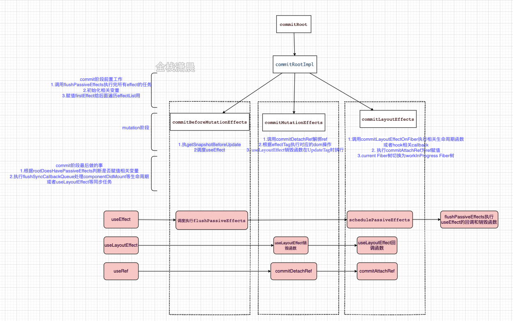

# React Commit 阶段源码解析：

## commit流程：



## 1.commitRoot:

```js
function commitRoot(root) {
  const renderPriorityLevel = getCurrentPriorityLevel();
  // 实际上就是调用commitRootImpl
  runWithPriority(
    ImmediateSchedulerPriority,
    commitRootImpl.bind(null, root, renderPriorityLevel),
  );
  return null;
}
```

## 2.commitRootImpl:

```js
function commitRootImpl(root, renderPriorityLevel) {
   do {
    // flushPassiveEffects 会在最后调用 flushSyncUpdateQueue，它有时会有副作用， 所以需要循环刷新副作用，直到所有的副作用都执行了
    flushPassiveEffects();
  } while (rootWithPendingPassiveEffects !== null);

	// 初始化相关变量
  const finishedWork = root.finishedWork; // FiberRootNode.current.alternate
  const lanes = root.finishedLanes;

  // 清空 finishedWork、finishedLanes、回调 数据
  root.finishedWork = null;
  root.finishedLanes = NoLanes;
  root.callbackNode = null;

    // 副作用相关，收集副作用，赋值firstEffect给后面遍历effectList用
  if (finishedWork.flags > PerformedWork) {
    if (finishedWork.lastEffect !== null) {
      finishedWork.lastEffect.nextEffect = finishedWork;
      firstEffect = finishedWork.firstEffect;
    } else {
      firstEffect = finishedWork;
    }
  } else {
    firstEffect = finishedWork.firstEffect;
  }

    // 有副作用，执行commit三个子阶段
  if (firstEffect !== null) {
    // 第一个阶段为 before mutation，递归 读取组件变更前的状态。
    // 类组件，调用getSnapshotBeforeUpdate，让我们可以在DOM变更前获取组件实例的信息；
    // 函数组件，调度useEffect，关于useEffect执行逻辑有点复杂，后期得对hooks补课
    focusedInstanceHandle = prepareForCommit(root.containerInfo); // null
    shouldFireAfterActiveInstanceBlur = false;
    ...

    nextEffect = firstEffect;
    // 第一个阶段 before mutation 将副作用链表执行一遍。
    do {
      try {
        // 下面展开
        commitBeforeMutationEffects();
      } catch (error) {
        invariant(nextEffect !== null, 'Should be working on an effect.');
        captureCommitPhaseError(nextEffect, error);
        nextEffect = nextEffect.nextEffect;
      }
    } while (nextEffect !== null);

    // 第二个阶段 mutation阶段，下面展开。
    nextEffect = firstEffect;
    do {
      try {
        commitMutationEffects(root, renderPriorityLevel);
      } catch (error) {
        invariant(nextEffect !== null, 'Should be working on an effect.');
        captureCommitPhaseError(nextEffect, error);
        nextEffect = nextEffect.nextEffect;
      }
    } while (nextEffect !== null);

    // 将  work-in-progress 树 切换成 current tree，
    // componentWillUnmount会在mutation阶段执行。此时current Fiber树还指向前一次更新的Fiber树，在生命周期钩子内获取的DOM还是更新前的。
    // componentDidMount和componentDidUpdate会在layout阶段执行。
    // 此时current Fiber树已经指向更新后的Fiber树，在生命周期钩子内获取的DOM就是更新后的。
    root.current = finishedWork;

    // 第三个阶段 layout 阶段，下面展开
    nextEffect = firstEffect;
    do {
      try {
        commitLayoutEffects(root, lanes);
      } catch (error) {
        invariant(nextEffect !== null, 'Should be working on an effect.');
        captureCommitPhaseError(nextEffect, error);
        nextEffect = nextEffect.nextEffect;
      }
    } while (nextEffect !== null);

    nextEffect = null;

    // 让 Scheduler 退出，浏览器就可以重新绘制，设置一个空的函数
    requestPaint();
  }

}
```

在commitRootImpl的函数中主要分三个部分：

### 2.1 commit阶段前置工作:

1. 调用flushPassiveEffects执行完所有effect的任务
2. 初始化相关变量
3. 赋值firstEffect给后面遍历effectList用

```js
 do {
    // flushPassiveEffects 会在最后调用 flushSyncUpdateQueue，它有时会有副作用， 所以需要循环刷新副作用，直到所有的副作用都执行了
    flushPassiveEffects();
  } while (rootWithPendingPassiveEffects !== null);

	// 初始化相关变量
  const finishedWork = root.finishedWork; // FiberRootNode.current.alternate
  const lanes = root.finishedLanes;

  // 清空 finishedWork、finishedLanes、回调 数据
  root.finishedWork = null;
  root.finishedLanes = NoLanes;
  root.callbackNode = null;

    // 副作用相关，收集副作用，赋值firstEffect给后面遍历effectList用
  if (finishedWork.flags > PerformedWork) {
    if (finishedWork.lastEffect !== null) {
      finishedWork.lastEffect.nextEffect = finishedWork;
      firstEffect = finishedWork.firstEffect;
    } else {
      firstEffect = finishedWork;
    }
  } else {
    firstEffect = finishedWork.firstEffect;
  }
```

### 2.2 mutation阶段:

 遍历``effectList``分别执行三个方法``commitBeforeMutationEffects``、``commitMutationEffects``、``commitLayoutEffects``执行对应的dom操作和生命周期

```js
function commitRootImpl(root, renderPriorityLevel) {
  // 有副作用，执行commit三个子阶段
 if (firstEffect !== null) {
   nextEffect = firstEffect;
    // 第一个阶段 before mutation 将副作用链表执行一遍。
    do {
      ...
      commitBeforeMutationEffects();
    } while (nextEffect !== null);

   // 第二个阶段 mutation阶段，下面展开。
    nextEffect = firstEffect;
    do {
      ...
      commitMutationEffects(root, renderPriorityLevel);
    } while (nextEffect !== null);

   // 第三个阶段 layout 阶段，下面展开
    nextEffect = firstEffect;
    do {
      ...
      commitLayoutEffects(root, lanes);
    } while (nextEffect !== null);
 }
}
```

### 2.3 mutation 后:

1. 根据rootDoesHavePassiveEffects赋值相关变量
2. 执行flushSyncCallbackQueue处理componentDidMount等生命周期或者useLayoutEffect等同步任务

```js
const rootDidHavePassiveEffects = rootDoesHavePassiveEffects;

// 根据rootDoesHavePassiveEffects赋值相关变量
if (rootDoesHavePassiveEffects) {
  rootDoesHavePassiveEffects = false;
  rootWithPendingPassiveEffects = root;
  pendingPassiveEffectsLanes = lanes;
  pendingPassiveEffectsRenderPriority = renderPriorityLevel;
} else {}
//...

// 确保被调度
ensureRootIsScheduled(root, now());

// ...

// 执行flushSyncCallbackQueue处理componentDidMount等生命周期或者useLayoutEffect等同步任务
flushSyncCallbackQueue();

return null;

```

### mutation阶段三个函数：

#### 1. commitBeforeMutationEffects：

```js
function commitBeforeMutationEffects() {
  while (nextEffect !== null) {
    const current = nextEffect.alternate;
    const effectTag = nextEffect.effectTag;

    // 在commitBeforeMutationEffectOnFiber函数中会执行getSnapshotBeforeUpdate
    if ((effectTag & Snapshot) !== NoEffect) {
      commitBeforeMutationEffectOnFiber(current, nextEffect);
    }

    // scheduleCallback调度useEffect
    if ((effectTag & Passive) !== NoEffect) {
      if (!rootDoesHavePassiveEffects) {
        rootDoesHavePassiveEffects = true;
        scheduleCallback(NormalSchedulerPriority, () => {
          flushPassiveEffects();
          return null;
        });
      }
    }
    nextEffect = nextEffect.nextEffect;//遍历effectList，由下至上
  }
}
```

``commitBeforeMutationEffects``主要做了两件事:

##### 执行getSnapshotBeforeUpdate

​	在源码中``commitBeforeMutationEffectOnFiber``对应的函数``commitBeforeMutationLifeCycles``会去调用实例的``getSnapshotBeforeUpdate``，现在我们知道了``getSnapshotBeforeUpdate``是在``mutation``阶段中的``commitBeforeMutationEffect``函数中执行的，而``commit``阶段是同步的，所以``getSnapshotBeforeUpdate``也同步执行。

```js
function commitBeforeMutationLifeCycles(
  current: Fiber | null,
  finishedWork: Fiber,
): void {
	switch (finishedWork.tag) {
    ...
    case ClassComponent: {
      if (finishedWork.flags & Snapshot) {
        if (current !== null) {
          const prevProps = current.memoizedProps;
          const prevState = current.memoizedState;
          const instance = finishedWork.stateNode;

          const snapshot = instance.getSnapshotBeforeUpdate(
            finishedWork.elementType === finishedWork.type
              ? prevProps
              : resolveDefaultProps(finishedWork.type, prevProps),
            prevState,
          );
          instance.__reactInternalSnapshotBeforeUpdate = snapshot;
        }
      }
      return;
    }
  }
}
```

##### 调度useEffect

在``flushPassiveEffects``函数中调用``flushPassiveEffectsImpl``遍历``pendingPassiveHookEffectsUnmount``和``pendingPassiveHookEffectsMount``，执行对应的``effect``回调和销毁函数，而这两个数组是在``commitLayoutEffects``函数中赋值的**（待会就会讲到）**，``mutation``后``effectList``赋值给``rootWithPendingPassiveEffects``，然后``scheduleCallback``调度执行``flushPassiveEffects``

```js
function flushPassiveEffectsImpl() {
  if (rootWithPendingPassiveEffects === null) {//在mutation后变成了root
    return false;
  }
  const unmountEffects = pendingPassiveHookEffectsUnmount;
  pendingPassiveHookEffectsUnmount = [];//useEffect的回调函数
  for (let i = 0; i < unmountEffects.length; i += 2) {
    const effect = ((unmountEffects[i]: any): HookEffect);
    //...
    const destroy = effect.destroy;
    destroy();
  }

  const mountEffects = pendingPassiveHookEffectsMount;//useEffect的销毁函数
  pendingPassiveHookEffectsMount = [];
  for (let i = 0; i < mountEffects.length; i += 2) {
    const effect = ((unmountEffects[i]: any): HookEffect);
    //...
    const create = effect.create;
    effect.destroy = create();
  }
}


```

 componentDidUpdate或componentDidMount会在commit阶段同步执行(这个后面会讲到)，而useEffect会在commit阶段异步调度，所以适用于数据请求等副作用的处理。

#### 2. commitMutationEffects：

commitMutationEffects主要做了如下几件事

1. 调用commitDetachRef解绑ref
2. 根据effectTag执行对应的dom操作
3. useLayoutEffect销毁函数在UpdateTag时执行

```js
function commitMutationEffects(root: FiberRoot, renderPriorityLevel) {
  //遍历effectList
  while (nextEffect !== null) {

    const effectTag = nextEffect.effectTag;
    // 调用commitDetachRef解绑ref
    if (effectTag & Ref) {
      const current = nextEffect.alternate;
      if (current !== null) {
        commitDetachRef(current);
      }
    }

    // 根据effectTag执行对应的dom操作
    const primaryEffectTag =
      effectTag & (Placement | Update | Deletion | Hydrating);
    switch (primaryEffectTag) {
      // 插入dom
      case Placement: {
        commitPlacement(nextEffect);
        nextEffect.effectTag &= ~Placement;
        break;
      }
      // 插入更新dom
      case PlacementAndUpdate: {
        // 插入
        commitPlacement(nextEffect);
        nextEffect.effectTag &= ~Placement;
        // 更新
        const current = nextEffect.alternate;
        commitWork(current, nextEffect);
        break;
      }
     	//...
      // 更新dom
      case Update: {
        const current = nextEffect.alternate;
        commitWork(current, nextEffect);
        break;
      }
      // 删除dom
      case Deletion: {
        commitDeletion(root, nextEffect, renderPriorityLevel);
        break;
      }
    }

    nextEffect = nextEffect.nextEffect;
  }
}

```

我们来看一下这几个``dom``操作函数：

##### commitPlacement插入节点：

简化后的代码很清晰，首先找到该节点最近的父节点和兄弟节点，然后根据``isContainer``来判断是插入到兄弟节点前还是append到parent节点后

```js
function commitPlacement(finishedWork: Fiber): void {
	//...
  const parentFiber = getHostParentFiber(finishedWork);//找到最近的parent

  let parent;
  let isContainer;
  const parentStateNode = parentFiber.stateNode;
  switch (parentFiber.tag) {
    case HostComponent:
      parent = parentStateNode;
      isContainer = false;
      break;
    //...

  }
  const before = getHostSibling(finishedWork);//找兄弟节点
  if (isContainer) {
    insertOrAppendPlacementNodeIntoContainer(finishedWork, before, parent);
  } else {
    insertOrAppendPlacementNode(finishedWork, before, parent);
  }
}
```

##### commitWork更新节点：

 在简化后的源码中可以看到

 如果fiber的tag是SimpleMemoComponent会调用commitHookEffectListUnmount执行对应的hook的销毁函数，可以看到传入的参数是HookLayout | HookHasEffect，也就是说执行useLayoutEffect的销毁函数。

 如果是HostComponent，那么调用commitUpdate，commitUpdate最后会调用updateDOMProperties处理对应Update的dom操作

```js
function commitWork(current: Fiber | null, finishedWork: Fiber): void {
  if (!supportsMutation) {
    switch (finishedWork.tag) {
       //...
      case SimpleMemoComponent: {
       	commitHookEffectListUnmount(HookLayout | HookHasEffect, finishedWork);
      }
     //...
    }
  }

  switch (finishedWork.tag) {
    //...
    case HostComponent: {
      //...
      commitUpdate(	// updateDOMProperties
            instance,
            updatePayload,
            type,
            oldProps,
            newProps,
            finishedWork,
          );
      }
      return;
    }
}
```

```js
function updateDOMProperties(
  domElement: Element,
  updatePayload: Array<any>,
  wasCustomComponentTag: boolean,
  isCustomComponentTag: boolean,
): void {
  // TODO: Handle wasCustomComponentTag
  for (let i = 0; i < updatePayload.length; i += 2) {
    const propKey = updatePayload[i];
    const propValue = updatePayload[i + 1];
    if (propKey === STYLE) {
      setValueForStyles(domElement, propValue);
    } else if (propKey === DANGEROUSLY_SET_INNER_HTML) {
      setInnerHTML(domElement, propValue);
    } else if (propKey === CHILDREN) {
      setTextContent(domElement, propValue);
    } else {
      setValueForProperty(domElement, propKey, propValue, isCustomComponentTag);
    }
  }
}
```

##### commitDeletion删除节点:

 如果是ClassComponent会执行componentWillUnmount，删除fiber，如果是FunctionComponent 会删除ref、并执行useEffect的销毁函数，具体可在源码中查看unmountHostComponents、commitNestedUnmounts、detachFiberMutation这几个函数

```js
function commitDeletion(
  finishedRoot: FiberRoot,
  current: Fiber,
  renderPriorityLevel: ReactPriorityLevel,
): void {
  if (supportsMutation) {
    // 执行componentWillUnmount
    unmountHostComponents(finishedRoot, current, renderPriorityLevel);
  } else {
    // 执行componentWillUnmount
    commitNestedUnmounts(finishedRoot, current, renderPriorityLevel);
  }
  const alternate = current.alternate;
  detachFiberMutation(current);
  if (alternate !== null) {
    // 将节点从树中移除
    detachFiberMutation(alternate);
  }
}
```

#### 3. commitLayoutEffects：

在commitMutationEffects之后所有的dom操作都已经完成，可以访问dom了，commitLayoutEffects主要做了

1. 调用commitLayoutEffectOnFiber执行相关生命周期函数或者hook相关callback
2. 执行commitAttachRef为ref赋值

```js
function commitLayoutEffects(root: FiberRoot, committedLanes: Lanes) {
  while (nextEffect !== null) {
    const effectTag = nextEffect.effectTag;

    // 调用commitLayoutEffectOnFiber执行生命周期和hook
    if (effectTag & (Update | Callback)) {
      const current = nextEffect.alternate;
      commitLayoutEffectOnFiber(root, current, nextEffect, committedLanes);
    }

    // ref赋值
    if (effectTag & Ref) {
      commitAttachRef(nextEffect);
    }

    nextEffect = nextEffect.nextEffect;
  }
}
```

##### commitLayoutEffectOnFiber:

在源码中commitLayoutEffectOnFiber函数的别名是commitLifeCycles，在简化后的代码中可以看到，commitLifeCycles会判断fiber的类型，SimpleMemoComponent会执行useLayoutEffect的回调，然后调度useEffect，ClassComponent会执行componentDidMount或者componentDidUpdate，this.setState第二个参数也会执行，HostRoot会执行ReactDOM.render函数的第三个参数，例如

```js
ReactDOM.render(<App />, document.querySelector("#root"), function() {
  console.log("root mount");
});
```

现在可以知道useLayoutEffect是在commit阶段同步执行，useEffect会在commit阶段异步调度

```js
function commitLifeCycles(
  finishedRoot: FiberRoot,
  current: Fiber | null,
  finishedWork: Fiber,
  committedLanes: Lanes,
): void {
  switch (finishedWork.tag) {
    case SimpleMemoComponent: {
      // 此函数会调用useLayoutEffect的回调
      commitHookEffectListMount(HookLayout | HookHasEffect, finishedWork);
      // 向pendingPassiveHookEffectsUnmount和pendingPassiveHookEffectsMount中push effect						// 并且调度它们
      schedulePassiveEffects(finishedWork);
    }
    case ClassComponent: {
      //条件判断...
      instance.componentDidMount();
      //条件判断...
      instance.componentDidUpdate(//update 在layout期间同步执行
        prevProps,
        prevState,
     	instance.__reactInternalSnapshotBeforeUpdate,
      );      
    }


    case HostRoot: {
      commitUpdateQueue(finishedWork, updateQueue, instance);//render第三个参数
    }

  }
}
```

 在schedulePassiveEffects中会将useEffect的销毁和回调函数push到pendingPassiveHookEffectsUnmount和pendingPassiveHookEffectsMount中

```js
function schedulePassiveEffects(finishedWork: Fiber) {
  const updateQueue: FunctionComponentUpdateQueue | null = (finishedWork.updateQueue: any);
  const lastEffect = updateQueue !== null ? updateQueue.lastEffect : null;
  if (lastEffect !== null) {
    const firstEffect = lastEffect.next;
    let effect = firstEffect;
    do {
      const {next, tag} = effect;
      if (
        (tag & HookPassive) !== NoHookEffect &&
        (tag & HookHasEffect) !== NoHookEffect
      ) {
        //push useEffect的销毁函数并且加入调度
        enqueuePendingPassiveHookEffectUnmount(finishedWork, effect);
        //push useEffect的回调函数并且加入调度
        enqueuePendingPassiveHookEffectMount(finishedWork, effect);
      }
      effect = next;
    } while (effect !== firstEffect);
  }
}
```

##### commitAttachRef:

 commitAttachRef中会判断ref的类型，执行ref或者给ref.current赋值

```js
function commitAttachRef(finishedWork: Fiber) {
  const ref = finishedWork.ref;
  if (ref !== null) {
    const instance = finishedWork.stateNode;

    let instanceToUse;
    switch (finishedWork.tag) {
      case HostComponent:
        instanceToUse = getPublicInstance(instance);
        break;
      default:
        instanceToUse = instance;
    }

    if (typeof ref === "function") {
      // 执行ref回调
      ref(instanceToUse);
    } else {
      // 如果是值的类型则赋值给ref.current
      ref.current = instanceToUse;
    }
  }
}
```
