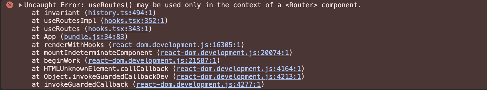

# Reacr Router v6 基本使用

## v5 和 v6 区别

`在v5中对主要使用以下这些组件来定位路由`
- **Switch**：将Route进行包裹，目的是只有匹配到的路由组件，才被显示，匹配不到的是不显示
  - 如果一个组件上出现多了相同的路由匹配路径，在跳转时，会同时显示，使用**Switch**就可以打断重复的组件被显示

```javascript
import { Switch,Route } from 'react-router-dom'

<Switch>
     <Route  path="/home" component={Home} />
     <Route  path="/list" component={List}/>
     <Route  path="/list" component={List}/>
</Switch>
```

- **Route**：定义路由，通过`path`来指定路径，`component`来指定显示组件
```javascript
<Route  path="/list" component={List}/>
```

`在v6中去除了原来的Switch组件，取而代之的是Routes进行包裹，同时对于Route的使用也有所变化`

在v6中使用Route，`component`替换成了`element`，同时参数**不再是组件实例**，而是传入对应的**jsx**，也就是React.createElement的调用

### 1.用\<Routes> children形式替代\<Switch>

> 1. v6版本中移出了先前的`<Switch>`，引入了新的替代者：   `<Routes>`。
> 2. `<Routes>`和v5版本的Switch一样，如果匹配上了，往下就不会再匹配了。
>3. `<Routes>` 和 `<Route>`要配合使用，且必须要用`<Routes>`包裹`<Route>`。
> 4. `<Route>` 相当于一个 if 语句，如果其路径与当前 URL 匹配，则呈现其对应的组件。
> 5. `<Route caseSensitive>` 属性用于指定：匹配时是否区分大小写（默认为 false）。
> 6. 当URL发生变化时，`<Routes>` 都会查看其所有子 `<Route>` 元素以找到最佳匹配并呈现组件 。
> 7. `<Route>` 也可以嵌套使用，且可配合useRoutes()配置 “路由表” ，但需要通过 `<Outlet>` 组件来渲染其子路由。

```javascript
// v6 写法
<Routes>
  <Route index path="/" element={<Home />} />
  <Route path="about" element={<About />} />
  <Route path="/users/:id" element={<User />} />
</Routes>
// v5 写法
<Switch>
  <Route exact path="/">
    <Home />
  </Route>
  <Route path="/about">
    <About />
  </Route>
  <Route path="/users/:id" children={<User />} />
</Switch>
```

### 2.去除Switch中的\<Redirect>，用react-router-dom中的Redirect 替代，或者用 \<Navigate> 实现
```javascript
// v5 写法
<Switch>
   <Redirect from="/" to="home" />
 </Switch>
// v6 写法
<Route path="/" element={<Navigate to="about-us"/>}/>
```

### 3.useRoutes路由表
我们可以通过数组形式定义一个路由表，有点类似vue的写法
```javascript
const routes = [
  {
    path: "home",
    element: <Home/>
  }, 
  {
    path: "about",
    element: <About/>
  },
  {
    path: '/',
    element: <Navigate to='/home' />
  }
] 

export default routes
```
然后在App或者父组件中通过useRoutes来构建路由表实例
```javascript
function App() {
  const routeElement = useRoutes(routes);
  return (
    <div className="App">
      <h2>React Router</h2>
      {routeElement}
    </div>
  );
}
```

### 4. 嵌套路由Outlet
> 当<Route>产生嵌套时，渲染其对应的后续子路由 (类似于vue中\<router-view/>)

路由表中通过`children`来定义子路由
```javascript
  {
    path: "/home",
    element: <Home/>,
    children: [
      {
        path: "sub1",
        element: <SubPageA/>
      },
      {
        path: "sub2",
        element: <SubPageB/>
      },
      {
        path: "sub3",
        element: <SubPageC/>
      },
    ]
  }, 
```
父路由组件中通过使用`Outlet`，来决定子路由最终在页面中展示的位置
```javascript
const Home = () => {
  return (
    <>
      <h2>Home</h2>
      <div className='nav-line'>
        <NavLink to={"sub1"}>SubPage_1</NavLink>
        <NavLink to={"sub2"}>SubPage_2</NavLink>
        <NavLink to={"sub3"}>SubPage_3</NavLink>
      </div>
      <div className='home-sub-router-wrapper'>
        {/* 指定路由组件呈现的位置 */}
        <Outlet/>
      </div>
    </>
  )
}
```

## 遇到的一些问题
### 1. useRoutes路由表使用时报错useRoutes() may be used only in the context of a <Router> component.
  
  该报错的主要原因是把BrowserRouter给定义到了App.js文件下，将BrowserRouter提到index.js的\<App>外面即可
```javascript
root.render(
  <React.StrictMode>
    <BrowserRouter>
      <App />
    </BrowserRouter>
  </React.StrictMode>
);
```