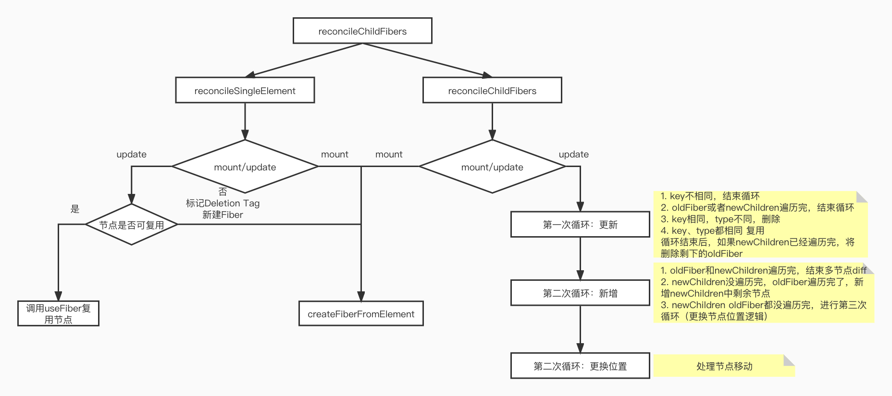

# React diff算法：

在render阶段更新Fiber节点时，会调用reconcileChildFibers来对比current Fiber和jsx对象构建workInProgress Fiber，这里current Fiber是指当前dom对应的fiber树，jsx是class组件render方法或者函数组件的返回值。

## 1. reconcileChildFibers：

```js
function reconcileChildFibers(
  returnFiber: Fiber,
  currentFirstChild: Fiber | null,
  newChild: any,
): Fiber | null {

  const isObject = typeof newChild === 'object' && newChild !== null;

  if (isObject) {
    switch (newChild.$$typeof) {
      case REACT_ELEMENT_TYPE:
				//单一节点diff
        return placeSingleChild(
            reconcileSingleElement(
              returnFiber,
              currentFirstChild,
              newChild,
              lanes,
            ),
          );
    }
  }
	//...
  
  if (isArray(newChild)) {
     //多节点diff
    return reconcileChildrenArray(
        returnFiber,
        currentFirstChild,
        newChild,
        lanes,
      );
  }

  // 删除节点
  return deleteRemainingChildren(returnFiber, currentFirstChild);
}
```

## reconcileChildFibers流程：

### 1.1 reconcileSingleElement单节点diff：

单点diff有如下几种情况：

- key和type相同表示可以复用节点
- key不同直接标记删除节点，然后新建节点
- key相同type不同，标记删除该节点和兄弟节点，然后新创建节点

```js
function reconcileSingleElement(
  returnFiber: Fiber,
  currentFirstChild: Fiber | null,
  element: ReactElement
): Fiber {
  const key = element.key;
  let child = currentFirstChild;
  
  //child节点不为null执行对比
  while (child !== null) {
    // 1.比较key
    if (child.key === key) {
      // 2.比较type
      switch (child.tag) {
        //...
        default: {
          if (child.elementType === element.type) {
            // type相同则可以复用 返回复用的节点
            return existing;
          }
          // type不同跳出
          break;
        }
      }
      //key相同，type不同则把fiber及和兄弟fiber都标记删除
      deleteRemainingChildren(returnFiber, child);
      break;
    } else {
      //key不同直接标记删除该节点
      deleteChild(returnFiber, child);
    }
    child = child.sibling; // 同层循环对比
  }
   
  //新建新Fiber
}
```

#### deleteRemainingChildren删除兄弟节点：

本质上就是遍历当前节点的sibling，然就执行deleteChild来标记Deletion

```js
function deleteRemainingChildren(
  returnFiber: Fiber,
  currentFirstChild: Fiber | null,
): null {
  if (!shouldTrackSideEffects) {
    return null;
  }
  let childToDelete = currentFirstChild;
  while (childToDelete !== null) {	// 遍历当前节点的sibling，执行deleteChild
    deleteChild(returnFiber, childToDelete);
    childToDelete = childToDelete.sibling;
  }
  return null;
}
```

#### deleteChild标记删除节点：

```js
function deleteChild(returnFiber: Fiber, childToDelete: Fiber): void {
  if (!shouldTrackSideEffects) {
    return;
  }
  const last = returnFiber.lastEffect;
  if (last !== null) {
    last.nextEffect = childToDelete;
    returnFiber.lastEffect = childToDelete;
  } else {
    returnFiber.firstEffect = returnFiber.lastEffect = childToDelete;
  }
  childToDelete.nextEffect = null;
  childToDelete.flags = Deletion; // 标记Deletion
}
```

### 1.2 reconcileChildrenArray多节点diff：

多节点diff比较复杂，我们分三种情况进行讨论，其中a表示更新前的节点，b表示更新后的节点

- 属性变化

  ```html
  const a = (
      <>
        <p key="0" name='0'>0</p>
        <p key="1">1</p>
      </>
    );
    const b = (
      <>
        <p key="0" name='00'>0</p>
        <p key="1">1</p>
      </>
    );
  ```

- type变化

  ```html
  const a = (
      <>
        <p key="0">0</p>
        <p key="1">1</p>
      </>
    );
    const b = (
      <>
        <div key="0">0</div>
        <p key="1">1</p>
      </>
    );
  ```

- 新增节点

  ```html
  const a = (
      <>
        <p key="0">0</p>
        <p key="1">1</p>
      </>
    );
    const b = (
      <>
        <p key="0">0</p>
        <p key="1">1</p>
        <p key="2">2</p>
      </>
    );
  ```

- 节点删除

  ```html
  const a = (
      <>
        <p key="0">0</p>
        <p key="1">1</p>
        <p key="2">2</p>
      </>
    );
    const b = (
      <>
        <p key="0">0</p>
        <p key="1">1</p>
      </>
    );
  ```

- 节点位置变化

  ```html
  	const a = (
      <>
        <p key="0">0</p>
        <p key="1">1</p>
      </>
    );
    const b = (
      <>
        <p key="1">1</p>
        <p key="0">0</p>
      </>
    );
  ```

reconcileChildrenArray多节点diff中存在三个for循环遍历，**第一个**处理节点的更新（包括props更新和type更新和删除），**第二个**处理其他情况**（节点新增）**，其原因在于在大多数的应用中，节点更新的频率更加频繁，**第三个**处理位节点置改变。

#### 1.2.1 第一次循环（更新节点）

- 第一次遍历 因为老的节点存在于current Fiber中，所以它是个链表结构（Fiber双缓存结构，链表通过child、return、sibling链接），而newChildren存在于jsx中，所以遍历对比的时候拿**newChildren[i]**与**oldFiber**进行对比，对比完后i++， nextOldFiber = oldFiber.sibling。在第一轮遍历中，会处理**三种情况**，其中第**1，2两种**情况会结束第一次循环

	1. key不同，结束第一次循环
	1. oldFiber或者newChildren遍历完，结束第一次循环
	1. key相同type不同， 标记DELETION
	1. key和type都相同，即可复用节点

```js
		let resultingFirstChild: Fiber | null = null; //diff之后返回的第一个节点
    let previousNewFiber: Fiber | null = null; //新节点中上次对比过的节点

    let oldFiber = currentFirstChild; //正在对比的oldFiber
    let lastPlacedIndex = 0; //上次可复用的节点位置 或者oldFiber的位置
    let newIdx = 0; //新节点中对比到了的位置
    let nextOldFiber = null; //正在对比的oldFiber
    for (; oldFiber !== null && newIdx < newChildren.length; newIdx++) {
      if (oldFiber.index > newIdx) {
        nextOldFiber = oldFiber;
        oldFiber = null;
      } else {
        nextOldFiber = oldFiber.sibling;
      }
      const newFiber = updateSlot( //更新节点，如果key不同则newFiber=null 
        returnFiber,
        oldFiber,
        newChildren[newIdx],
        lanes,
      );
      // 一旦oldFiber与newFiber的key不相等，跳出第一循环
      if (newFiber === null) {
        if (oldFiber === null) {
          oldFiber = nextOldFiber;
        }
        break;
      }
      // placeChild 来判断新节点的位置是否需要移动
      lastPlacedIndex = placeChild(newFiber, lastPlacedIndex, newIdx);
      if (previousNewFiber === null) {
        resultingFirstChild = newFiber;
      } else {
        previousNewFiber.sibling = newFiber;
      }
      previousNewFiber = newFiber;
      oldFiber = nextOldFiber;
    }
```

##### updateSlot试图复用老节点：

```js
function updateSlot(returnFiber, oldFiber, newChild) {
  const key = oldFiber ? oldFiber.key : null;
  //如果新的虚拟DOM的key和老fiber的key一样
  if (newChild.key === key) {
    return updateElement(returnFiber, oldFiber, newChild);
  } else {
    //如果key不一样，直接结束返回null
    return null;
  }
}

```

##### updateElement更新节点：

```js
 function updateElement(
    returnFiber: Fiber,
    current: Fiber | null,
    element: ReactElement,
    lanes: Lanes,
  ): Fiber {
    if (current !== null) {
      if (current.elementType === element.type) {
        const existing = useFiber(current, element.props); // 复用老fiber
        existing.ref = coerceRef(returnFiber, current, element);
        existing.return = returnFiber;
        return existing;
      } else if (enableBlocksAPI && current.tag === Block) {
        ...
      }
    }
    // 如果没有老的fiber，则属于新增
    const created = createFiberFromElement(element, returnFiber.mode, lanes);
    created.ref = coerceRef(returnFiber, current, element);
    created.return = returnFiber;
    return created;
  }
```

第一次循环结束后要进行一个判断：

如果newChildren已经遍历完，那需要将剩下的oldFiber都标记Deletion，同时退出函数。

```js
if (newIdx === newChildren.length) {
  deleteRemainingChildren(returnFiber, oldFiber); // 将oldFiber中没遍历完的节点标记为DELETION
  return resultingFirstChild;
}
```

#### 1.2.2  第二次循环（新增节点）

- 第二次遍历，考虑三种情况

	1. newChildren和oldFiber都遍历完：多节点diff过程结束
	1. newChildren没遍历完，oldFiber遍历完，**新增节点**并标记为Placement。
	1. newChildren和oldFiber没遍历完，则进入节点移动的逻辑

```js
if (oldFiber === null) { // 如果oldFiber 已经遍历完
      for (; newIdx < newChildren.length; newIdx++) {
        // newChildren没遍历完，新增节点createChild，并标记Placement(placeChild)
        const newFiber = createChild(returnFiber, newChildren[newIdx], lanes);
        if (newFiber === null) {
          continue;
        }
        // 标记Placement
        lastPlacedIndex = placeChild(newFiber, lastPlacedIndex, newIdx);
        if (previousNewFiber === null) {
          // TODO: Move out of the loop. This only happens for the first run.
          resultingFirstChild = newFiber;
        } else {
          previousNewFiber.sibling = newFiber;
        }
        previousNewFiber = newFiber;
      }
      return resultingFirstChild;
    }
```

#### 1.2.3 第三次循环（改变节点位置）

- 第三次遍历

在执行第三次遍历前，会先把余下的oldFiber和其对应的 **key | index** 做成映射。

第三轮遍历延用了上一轮遍历的**newIdx变量**。说明第三轮循环是在上轮循环结束的地方开始再次遍历剩下的 newChildren。

第三轮循环主要调用了 **「updateFromMap」** 来处理节点，在这里需要用 newChild 的 key 去 existingChildren 中找对应的 Fiber。

- 能找到 key 相同的，则说明这个节点只是位置变了，是可以复用的。
- 找不到 key 相同的，则说明这个节点应该是新增的。

```js
		// 将剩下的旧节点构造成key/index：child结构的map
    const existingChildren = mapRemainingChildren(returnFiber, oldFiber);
		for (; newIdx < newChildren.length; newIdx++) { //第三次循环 处理节点移动
      const newFiber = updateFromMap(
        existingChildren,
        returnFiber,
        newIdx,
        newChildren[newIdx],
        lanes,
      );
      if (newFiber !== null) {
        if (shouldTrackSideEffects) {
          if (newFiber.alternate !== null) {
            existingChildren.delete(
              newFiber.key === null ? newIdx : newFiber.key,	// 删除找到的节点
            );
          }
        }
        lastPlacedIndex = placeChild(newFiber, lastPlacedIndex, newIdx);	// 标记节点新增（Placement）
        if (previousNewFiber === null) {
          resultingFirstChild = newFiber;
        } else {
          previousNewFiber.sibling = newFiber;
        }
        previousNewFiber = newFiber;
      }
    }

		if (shouldTrackSideEffects) {
      // 将oldFiber中剩下的节点都delete
      existingChildren.forEach(child => deleteChild(returnFiber, child));
    }
```

#### placeChild标记节点（更新/新增）：

placeChild用来更新节点的位置，通过设立一个参照点**lastPlacedIndex**，然后更具这个参照点来判断newChildren的位置是否需要移动，需要移动则打上**Placement**，有了它，我们在遍历 newChildren 的时候可能会出现下面两种情况：

- 生成（或复用）的 Fiber 对应的老 index < lastPlacedIndex，这就说明这个 Fiber 的位置不对，因为 lastPlacedIndex 左边的应该全是已经遍历过的 newChild 生成的 Fiber。因此这个 Fiber 是需要被移动的，打上 flag。
- 如果 Fiber 对应的老 index >= lastPlacedIndex，那就说明这个 Fiber 的相对位置是 ok 的，可以不用移动，但是我们需要更新一下参照点，把参照点更新成这个 Fiber 对应的老 index。

```js
  function placeChild(
    newFiber: Fiber,
    lastPlacedIndex: number,
    newIndex: number,
  ): number {
    newFiber.index = newIndex;
    if (!shouldTrackSideEffects) {
      return lastPlacedIndex;
    }
    const current = newFiber.alternate;
    if (current !== null) {
      const oldIndex = current.index;
      if (oldIndex < lastPlacedIndex) {
        // oldIndex < lastPlacedIndex fiber位置不对需要移动，打上Placement标签
        newFiber.flags = Placement;
        return lastPlacedIndex;
      } else { // fiber位置可以不动，改变参照点
        return oldIndex;
      }
    } else {
      // 新增节点，打上Placement标签，改变参照点
      newFiber.flags = Placement;
      return lastPlacedIndex;
    }
  }
```

我们可以举个例子：

```
// 旧
[<div key='a' />, <div key='b' />, <div key='c' />, <div key='d' />]
 
// 新
[<div key='c' />, <div key='a' />, <div key='b' />, <div key='d' />, <div key='e' />]
```

lastPlacedIndex 初始值为 0，

1. 首先处理第一个节点 c，给节点 c 的 index 赋值为最新值 0，c.index = 0。可以看到 c 的 oldIndex 为 2，此时 oldIndex > lastPlacedIndex，无需对 c 做移动，将 lastPlacedIndex 赋值为 2。

2. 此时 lastPlacedIndex = 2。然后处理节点 a，a.index = 1。a 的 oldIndex 为 0，此时 oldIndex < lastPlacedIndex，因此需要对 a 打上 Placement 标记，lastPlacedIndex 维持不变。

3. 此时 lastPlacedIndex 仍然等于 2。然后处理节点 b，b.index = 2。b 的 oldIndex 为 1，此时 oldIndex < lastPlacedIndex，需要对 b 打上 Placement 标记，将 lastPlacedIndex 维持不变。

4. 此时 lastPlacedIndex 仍然等于 2。然后处理节点 d，b.index = 3。d 的 oldIndex 为 3，此时 oldIndex > lastPlacedIndex，无需对 d 做移动，将 lastPlacedIndex 赋值为 3。

5. 此时 lastPlacedIndex = 3。然后处理节点 e，e.index = 4。由于 e 是新建节点，所以 e 的 oldIndex 为 0，此时 oldIndex < lastPlacedIndex，因此需要对 e 打上 Placement 标记，lastPlacedIndex 维持不变。

因此最终需要变动位置的节点是 a b e。

这里可以看到其实最高效的改动是移动 c 和 e，但是 React 的 diff 逻辑选择了固定住 c，移动 a b，因此我们平时写代码的时候尽量避免把节点从后面提到前面的操作。

为 newChildren 里的所有 element 都生成了 Fiber 并连接好之后，返回第一个 child ，至此生成子节点的步骤就完成了。

### 整个diff过程主要流程：



