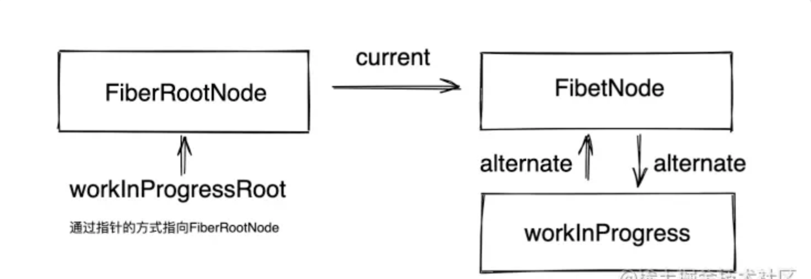
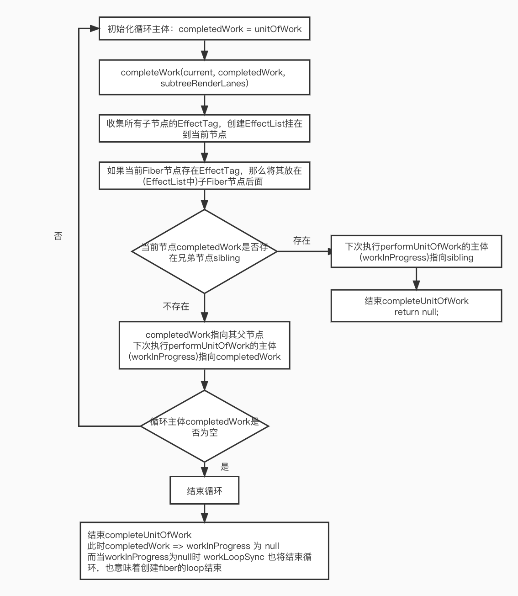
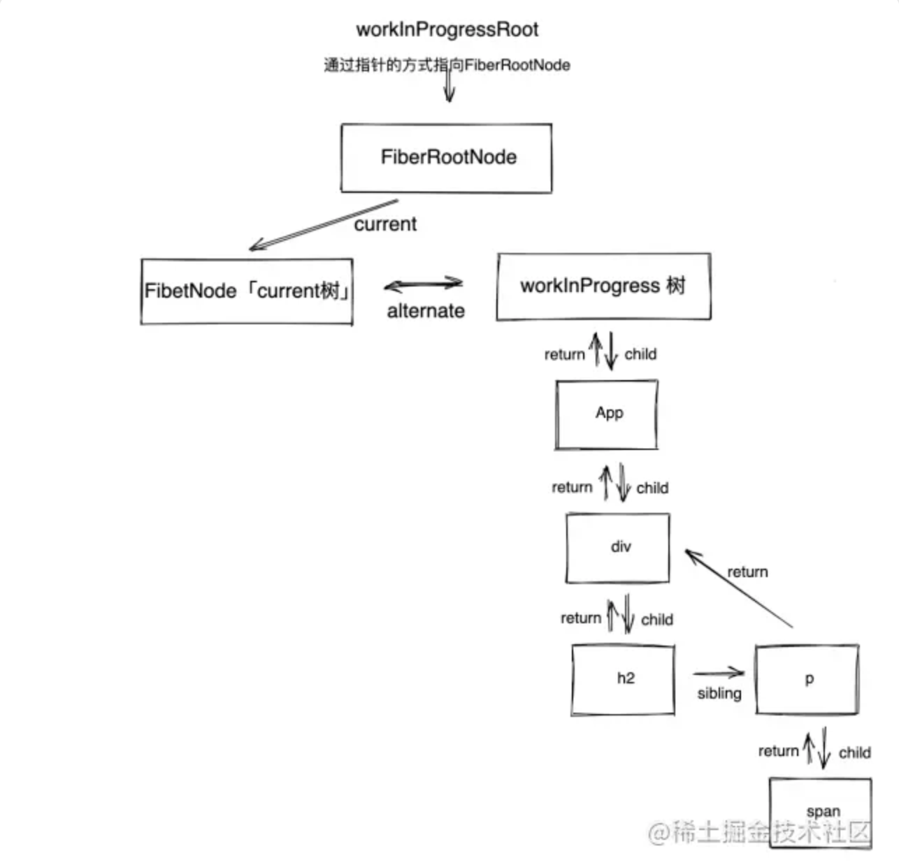
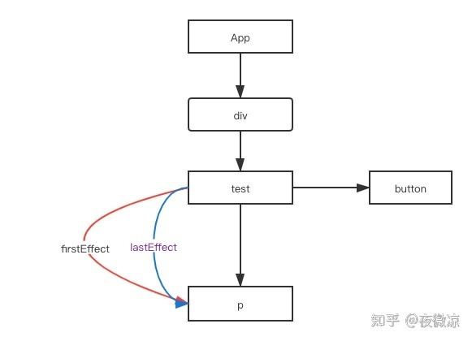
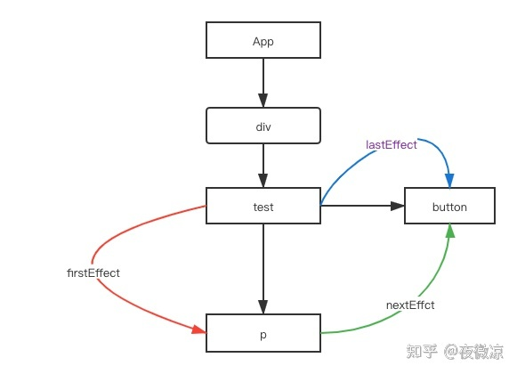
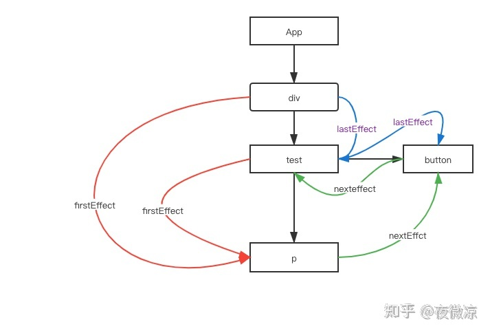
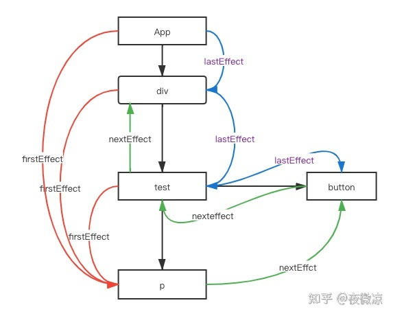
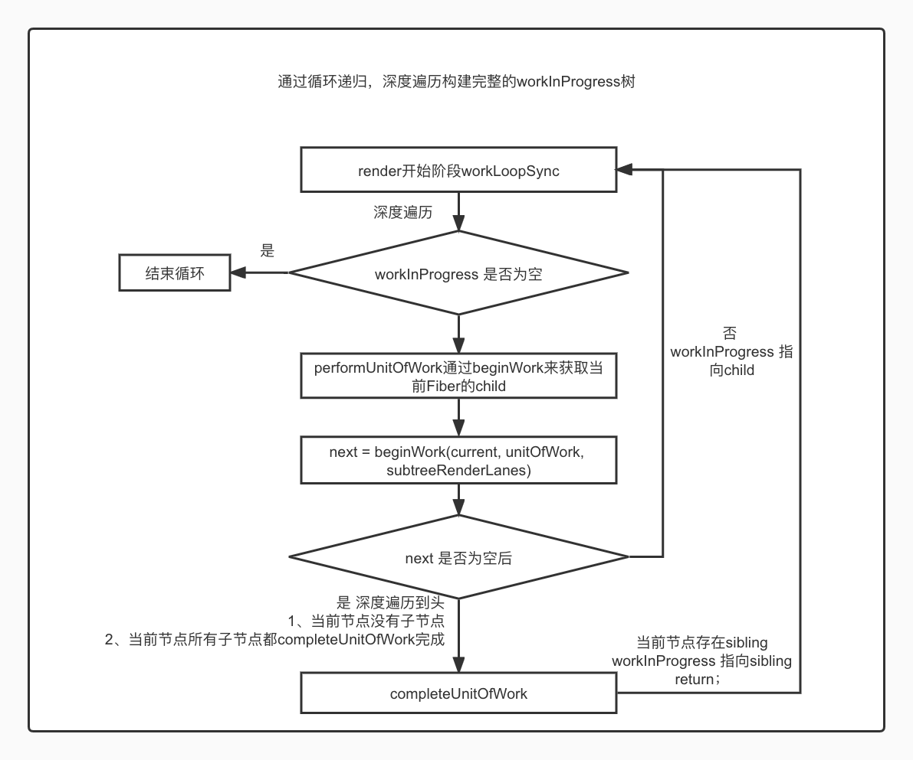
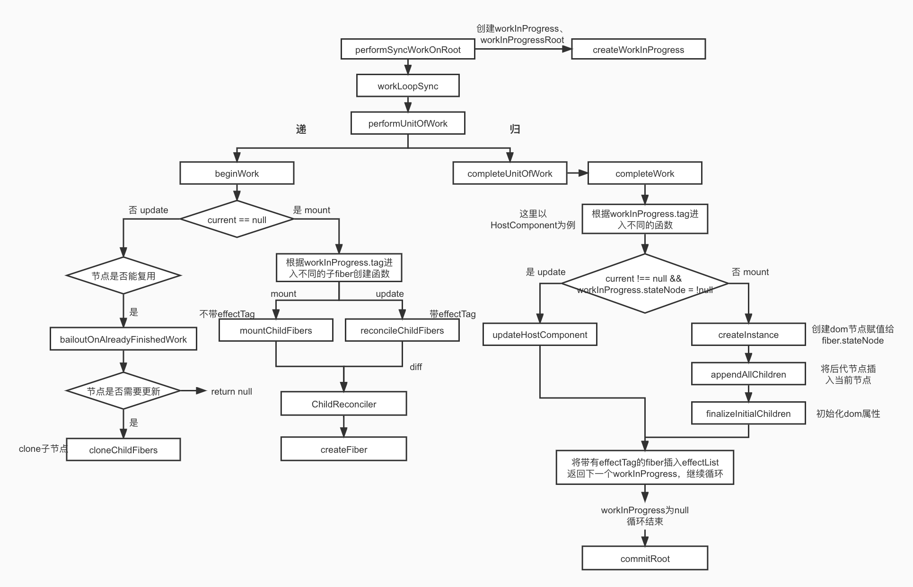

# React Render阶段源码解析：

## 1.ReactDom.render注册：

首先我们来到 ``packages/react-dom/src/client/ReactDOMRoot.js``文件下，``ReactDom.render``函数便是在ReactDOMRoot的原型上注册的。

```js
ReactDOMRoot.prototype.render = ReactDOMBlockingRoot.prototype.render = function(
  children: ReactNodeList,
): void {
  const root = this._internalRoot; // FiberRootNode
  if (__DEV__) {
   ...
  }
  updateContainer(children, root, null, null);
}
```

可以看到``render``函数先拿到``FiberRootNode``，然后执行``updateContainer``,前文初始化讲过``updateContainer``

- 他会先创建一个Update对象
- 更新链表，将update插入fiber.updateQueue.shared.pending上
- 在最后会调用``scheduleUpdateOnFiber``来实现节点调度。

随后便正式开启render

## 2. scheduleUpdateOnFiber:

``scheduleUpdateOnFiber``主要做了两件事

1. 通过markUpdateLaneFromFiberToRoot来找到 FiberRoot
2. 找到 FiberRoot 后通过ensureRootIsScheduled来开始调度

```js
// packages/react-reconciler/src/ReactFiberWorkLoop.old.js

// 创建Update之后，就需要开启调度更新了。
// 做的事情
// 1. 通过markUpdateLaneFromFiberToRoot来找到 FiberRoot
// 2. 找到 FiberRoot 后通过ensureRootIsScheduled来开始调度
export function scheduleUpdateOnFiber(
  fiber: Fiber,	// 首次 => FiberNode
  lane: Lane,
  eventTime: number,
) {
  // 判断是否是无限循环的update，是就直接报错
  // 比如在componentWillUpdate或者componentDidUpdate生命周期中重复调用setState方法，就会发生这种情况。
  // react限制了嵌套更新的数量防止无限制更新，限制的嵌套数量是50
  checkForNestedUpdates();
  warnAboutRenderPhaseUpdatesInDEV(fiber);

  // 找到FiberRoot
  const root = markUpdateLaneFromFiberToRoot(fiber, lane);
  if (root === null) {
    warnAboutUpdateOnUnmountedFiberInDEV(fiber);
    return null;
  }
    // React 有三种模式：legacy 模式「同步」， blocking 模式「过渡」，concurrent 模式「异步」
  // 这里是同步渲染的逻辑 legacy 模式，lane === SyncLane === true
  if (lane === SyncLane) {
    if (
      (executionContext & LegacyUnbatchedContext) !== NoContext &&
      (executionContext & (RenderContext | CommitContext)) === NoContext
    ) {
      ...
       // 这中间包含了大量的 beginWork、completeWork 调用栈，正是 render 的工作内容。
      performSyncWorkOnRoot(root);
    } else {
      // 开始调度
      ensureRootIsScheduled(root, eventTime);
      schedulePendingInteractions(root, lane);
     	...
    }
  } else {
    ...
    // 开始调度
    ensureRootIsScheduled(root, eventTime);
    schedulePendingInteractions(root, lane);
  }
  mostRecentlyUpdatedRoot = root;
}

```

## 3. performSyncWorkOnRoot：

```js
// packages/react-reconciler/src/ReactFiberWorkLoop.old.js

function performSyncWorkOnRoot(root) {
  let lanes;
  let exitStatus;
  // 这里会返回false
  /*
  export function includesSomeLane(a: Lanes | Lane, b: Lanes | Lane) {
    return (a & b) !== NoLanes;
  }
  */
  if (
    root === workInProgressRoot &&
    includesSomeLane(root.expiredLanes, workInProgressRootRenderLanes)
  ) {
    ...
  } else {
    // NoLanes 0
    // 获取下一个优先级
    lanes = getNextLanes(root, NoLanes);
    // 核心方法是这个，下面会展开
    exitStatus = renderRootSync(root, lanes);
  }

  // 得到 workInProgress 树
  const finishedWork: Fiber = (root.current.alternate: any);
  root.finishedWork = finishedWork;
  root.finishedLanes = lanes;
  // 开启提交阶段 下面展开
  commitRoot(root);
}
```

## 4. renderRootSync

``performSyncWorkOnRoot``中执行了``renderRootSync``，这个函数才是真正开始构建``workInProgress``的地方。

```js
function renderRootSync(root: FiberRoot, lanes: Lanes) {
  const prevExecutionContext = executionContext;
  executionContext |= RenderContext;
  // 大量的hooks预处理的一个errorCallback，这样好处是限制用户在非函数组件的时候使用hook报错
  const prevDispatcher = pushDispatcher();

  if (workInProgressRoot !== root || workInProgressRootRenderLanes !== lanes) {
    // 初始化是进入这里，workInProgressRoot ，workInProgressRootRenderLanes此时都是undefined
    // 创建 workInProgress，workInProgressRoot，workInProgressRootRenderLanes，下面会展开
    prepareFreshStack(root, lanes);
    // 记录交互的，存储在root中，memoizedInteractions字段
    startWorkOnPendingInteractions(root, lanes);
  }

  do {
    try {
      // 重点是这个方法，进行递归生成workInProgress(fiber)树
      workLoopSync();
      break;
    } catch (thrownValue) {
      handleError(root, thrownValue);
    }
  } while (true);
	...
  // Set this to null to indicate there's no in-progress render.
  workInProgressRoot = null;
  workInProgressRootRenderLanes = NoLanes;

  return workInProgressRootExitStatus;
}
```

## 4.1 prepareFreshStack:

在``renderRootSync``中我们调用了``prepareFreshStack``来对``workInProgress``树进行初始化，创建 和 current 节点很相似的fiber节点 。

```js
// packages/react-reconciler/src/ReactFiberWorkLoop.old.js
function prepareFreshStack(root: FiberRoot, lanes: Lanes) {
  root.finishedWork = null;
  root.finishedLanes = NoLanes;

  const timeoutHandle = root.timeoutHandle;

  // 可以看到 workInProgressRoot 其实就是FiberRootNode
  workInProgressRoot = root;
  // 创建workInProgress 其结构其实和FiberRootNode.current(FiberNode)是一样的，存在的时候可以进行复用
  workInProgress = createWorkInProgress(root.current, null);
  workInProgressRootRenderLanes = subtreeRenderLanes = workInProgressRootIncludedLanes = lanes;
  workInProgressRootExitStatus = RootIncomplete;
  workInProgressRootFatalError = null;
  workInProgressRootSkippedLanes = NoLanes;
  workInProgressRootUpdatedLanes = NoLanes;
  workInProgressRootPingedLanes = NoLanes;

}
```

### 4.1.1 createWorkInProgress:

通过createWorkInProgress来创建workInProgress，基本上就是拷贝一个FiberNode，同时通过alternate来将workInProgress和FiberNode两者连起来。

```js
// packages/react-reconciler/src/ReactFiber.old.js
export function createWorkInProgress(current: Fiber, pendingProps: any): Fiber {
  let workInProgress = current.alternate; // null
  if (workInProgress === null) {
    // 使用双缓存技术，通过两棵树可以方便复用一些节点，并且可以延迟创建哪些不会更新的对象，同样可以回收一些额外的内存
    // 创建fiber，和创建fiberNode是同一个方法
    workInProgress = createFiber(
      current.tag,
      pendingProps,
      current.key,
      current.mode,
    );


    // 主要逻辑双缓存结构：workInProgress.alternate => FiberNode && FiberNode.alternate => workInProgress
    workInProgress.alternate = current;
    current.alternate = workInProgress;
  } else { // 复用current内容
    workInProgress.pendingProps = pendingProps;
    // Needed because Blocks store data on type.
    workInProgress.type = current.type;

    ...
  }

  return workInProgress;
}
```

至此的FiberRoot结构是这样的：



## 4.2 workLoopSync:

上文``renderRootSync``中通过``do while``循环调用``workLoopSync``进行递归同步渲染操作。

**通过方法中的 while 循环，Fiber Reconciler 将通过“深度遍历”的策略来完成对整棵 workInProgress Fiber Tree 的创建。**

```js
// packages/react-reconciler/src/ReactFiberWorkLoop.old.js
function workLoopSync() {
  // 当workInProgress有内容时，会一直循环performUnitOfWork，知道workInProgress变为空
  while (workInProgress !== null) {
    performUnitOfWork(workInProgress);
  }
}
```

### 4.2.1 performUnitOfWork：

performUnitOfWork会记录一些值，并将workInProgress指向当前节点的下一个字节点，为外侧循环提供条件

```js
// /Users/bk/react/packages/react-reconciler/src/ReactFiberWorkLoop.old.js
// workInProgress 也就是unitOfWork，一开始的时候是FiberNode，然后去递归遍历整棵树，直到workInProgress为null
function performUnitOfWork(unitOfWork: Fiber): void {
  // 这边依赖 alternate 这个字段
  const current = unitOfWork.alternate; // workInProgress.alternate => FiberNode
  setCurrentDebugFiberInDEV(unitOfWork);

  let next;
  // unitOfWork.mode:8  ProfileMode:8
  if (enableProfilerTimer && (unitOfWork.mode & ProfileMode) !== NoMode) {
    // 赋值两个时间，profilerStartTime = now(), fiber.actualStartTime = now()
    startProfilerTimer(unitOfWork);
    // 这个next 永远都是返回 儿子节点，深度优先遍历，下面会展开
    next = beginWork(current, unitOfWork, subtreeRenderLanes);
    // fiber.actualDuration = now() - profilerStartTime，fiber.selfBaseDuration = elapsedTime，profilerStartTime = -1;
    // 知道执行了多长时间，以及恢复 profilerStartTime
    stopProfilerTimerIfRunningAndRecordDelta(unitOfWork, true);
  } else {
    next = beginWork(current, unitOfWork, subtreeRenderLanes);
  }

  resetCurrentDebugFiberInDEV();
	// 记录上一次的值
  unitOfWork.memoizedProps = unitOfWork.pendingProps;
  if (next === null) {
    // If this doesn't spawn new work, complete the current work.
    // 当next没有了，也就是说深度搜索这棵树已经到头了，可以开始完成节点了。
    // 两种：1.当前节点没有子节点了，2.当前节点的子节点全部都completeUnitOfWork完成了
    completeUnitOfWork(unitOfWork);
  } else {
    // 这里又把全局变量中的workInProgress赋值为next，为下一次循环的主体
    workInProgress = next;
  }

  ReactCurrentOwner.current = null;
}
```

#### 4.2.1.1 beginWork：

``beginWork``的入参是一对用 alternate 连接起来的 workInProgress 和 current 节点；其核心逻辑是根据 fiber 节点（workInProgress）的 tag 属性的不同，调用不同的节点创建函数。**递归中的“递”阶段，创建当前Fiber的节点和子节点。**

```js
// packages/react-reconciler/src/ReactFiberBeginWork.old.js
function beginWork(
  current: Fiber | null,
  workInProgress: Fiber,
  renderLanes: Lanes,
): Fiber | null {
  // current 一开始是FiberRootNode.current 也就是FiberNode 不为null
  // workInProgress 也就是当前的FiberNode 首次是current
  // renderLanes:1
  const updateLanes = workInProgress.lanes;

  if (__DEV__) {
   ...
  }
	// 1.update时满足条件即可复用current fiber进入bailoutOnAlreadyFinishedWork函数
  if (current !== null) {
    const oldProps = current.memoizedProps;
    const newProps = workInProgress.pendingProps;
    // 判断当props更新， 或者当上下文发生改变，type类型变化这些视为需要更新
    if (
      oldProps !== newProps ||
      hasLegacyContextChanged() ||
			(__DEV__ ? workInProgress.type !== current.type : false)
    ) {
      didReceiveUpdate = true; // 更新标记
    } else if (!includesSomeLane(renderLanes, updateLanes)) {
      didReceiveUpdate = false;
      switch (workInProgress.tag) {...}
      // 以后有了current后，并且满足条件就会复用 current 到 workInProgress
      // 返回workInProgress.child
      return bailoutOnAlreadyFinishedWork(current, workInProgress, renderLanes);
    } else {
      if ((current.flags & ForceUpdateForLegacySuspense) !== NoFlags) {
        didReceiveUpdate = true;
      } else {
        // 第一次进来会给更新打上一个不用更新的标记
        didReceiveUpdate = false;
      }
    }
  } else {
    didReceiveUpdate = false;
  }

  workInProgress.lanes = NoLanes;
  // 第二次，当 workInProgress app 组件 会进来这里,通过 workInProgress.type 调用 Commponet 方法 获取jsx
  switch (workInProgress.tag) {
    case IndeterminateComponent: { // tag = 2
      return mountIndeterminateComponent(current,workInProgress,workInProgress.type,renderLanes,);
    }
    ...
    // 根节点，第一次会进来这里,这里是创建app
    case HostRoot:
      return updateHostRoot(current, workInProgress, renderLanes);
    // 第三次，dom 标签，div标签
    case HostComponent:
      return updateHostComponent(current, workInProgress, renderLanes);
    // 文本节点
    case HostText:
      return updateHostText(current, workInProgress);
    ...
  }
}
```

从代码中可以看到参数中有``current Fiber``，也就是当前真实dom对应的``Fiber``树，之前介绍过Fiber存在双缓存机制，我们知道在首次渲染时除了``FiberRootNode``以外，``current``等于null，因为此时dom还没创建，而在update状态时current就不为null，所以代码中通过``current ！== null`` 来判断当前是``mount``还是``update``阶段。

- ``mount``阶段：根据``Fiber``的``tag``类型创建不同的的``Fiber``对象，最后都会调用到``reconcileChildren``创建子``Fiber``
- ``update``阶段：在构建``workInProgress``时，满足一定条件的时候会对``current Fiber``进行复用，也就是进入``bailoutOnAlreadyFinishedWork``的逻辑，能复用didReceiveUpdate变量是false，复用的条件是
- 1. ``oldProps === newProps`` && ``workInProgress.type === current.type`` 属性和``fiber``的``type``不变
  2. ``!includesSomeLane(renderLanes, updateLanes)`` 更新的优先级是否足够

##### 4.2.1.1.1 reconcileChildren:

创建子``fiber``的过程会进入``reconcileChildren``，该函数的作用是为``workInProgress fiber``节点生成它的``child fiber``即 ``workInProgress.child``。然后继续深度优先遍历它的子节点执行相同的操作。

```js
export function reconcileChildren(
  current: Fiber | null, // current就是当前fiber指向节点
  workInProgress: Fiber, // 当前workInProgress指向节点
  nextChildren: any, // 新更新的ReactElement
  renderLanes: Lanes,
) {
  if (current === null) {
    // mount
    workInProgress.child = mountChildFibers(
      workInProgress,
      null,
      nextChildren,
      renderLanes,
    );
  } else {
    // update
    workInProgress.child = reconcileChildFibers(
      workInProgress,
      current.child,
      nextChildren,
      renderLanes,
    );
  }
}
```

``reconcileChildren``会区分``mount和update``两种情况，进入``reconcileChildFibers``或``mountChildFibers``，``reconcileChildFibers``和``mountChildFibers``最终其实就是``ChildReconciler``传递不同的参数返回的函数，这个参数用来表示是否追踪副作用，在``ChildReconciler``中用``shouldTrackSideEffects``来判断是否为对应的节点打上``effectTag``，例如如果一个节点需要进行插入操作，需要满足两个条件：

1. ``fiber.stateNode!==null ``即``fiber``存在真实``dom``，真实``dom``保存在``stateNode``上
2. ``(fiber.effectTag & Placement) !== 0`` ``fiber``存在``Placement的effectTag``

```js
export const reconcileChildFibers = ChildReconciler(true);
export const mountChildFibers = ChildReconciler(false);
```

```js
function placeChild(
  newFiber: Fiber,
  lastPlacedIndex: number,
  newIndex: number,
): number {
  newFiber.index = newIndex;
  if (!shouldTrackSideEffects) { // 是否追踪副作用
    // Noop.
    return lastPlacedIndex;
  }
  const current = newFiber.alternate;
  if (current !== null) {
    const oldIndex = current.index;
    if (oldIndex < lastPlacedIndex) {
      // This is a move.
      newFiber.flags = Placement;
      return lastPlacedIndex;
    } else {
      // This item can stay in place.
      return oldIndex;
    }
  } else {
    // This is an insertion.
    newFiber.flags = Placement;
    return lastPlacedIndex;
  }
}
```

#### 4.2.1.2 completeUnitOfWork:

``completeUnitOfWork``是 `beginWork` 找到头了「没有子节点可以继续往下面找」，开始执行 completeUnitOfWork，当找到兄弟后，beginWork 又会重新被调用。因为workInProgress 会被更新。也就是说当 `beginWork`为`null`是，render进行“归”阶段--``completeUnitOfWork``

```js
function completeUnitOfWork(unitOfWork: Fiber): void {
  // 完成后移动到 sibling，没有 sibling，返回parent，让parent去判断下一步是 sibling、parent。
  let completedWork = unitOfWork; // 本次performUnitOfWork 的循环主体
  do {
    const current = completedWork.alternate;
    const returnFiber = completedWork.return; // 父节点

    // Check if the work completed or if something threw.
    if ((completedWork.flags & Incomplete) === NoFlags) {
      // 只要 beginWork 阶段正常执行后（即执行无异常），都会进到这一段逻辑来

      let next;
      next = completeWork(current, completedWork, subtreeRenderLanes);     

      /*
        假如completeWork返回不为空，则进入到下一次的performUnitOfWork循环中
        但这种情况太罕见，目前我只看到Suspense相关会有返回，因此此代码段姑且认为不会执行
      */
      if (next !== null) {
        workInProgress = next;
        return;
      }

      resetChildLanes(completedWork);
      /* 收集所有带有EffectTag的子Fiber节点，以链表(EffectList)的形式挂载在当前节点上 */
      if (
        returnFiber !== null &&
        (returnFiber.flags & Incomplete) === NoFlags
      ) {
        if (returnFiber.firstEffect === null) {
          returnFiber.firstEffect = completedWork.firstEffect;
        }
        if (completedWork.lastEffect !== null) {
          if (returnFiber.lastEffect !== null) {
            returnFiber.lastEffect.nextEffect = completedWork.firstEffect;
          }
          returnFiber.lastEffect = completedWork.lastEffect;
        }

        /* 如果当前Fiber节点(completedWork)EffectTag，那么将其放在(EffectList中)子Fiber节点后面 */
        const flags = completedWork.flags;

        /* 跳过NoWork/PerformedWork这两种EffectTag的节点，NoWork就不用解释了，PerformedWork是给DevTools用的 */
        if (flags > PerformedWork) {
          if (returnFiber.lastEffect !== null) {
            returnFiber.lastEffect.nextEffect = completedWork;
          } else {
            returnFiber.firstEffect = completedWork;
          }
          returnFiber.lastEffect = completedWork;
        }
      }
    } else {
      // 异常处理
     	...
    }
    // 取当前Fiber节点(completedWork)的兄弟(sibling)节点；
    // 如果有值，则结束completeUnitOfWork，并将该兄弟节点作为下次performUnitOfWork的主体(unitOfWork)
    const siblingFiber = completedWork.sibling;
    if (siblingFiber !== null) {
      workInProgress = siblingFiber;
      return;
    }
    // 如果没有兄弟节点，则直接将父节点作为下次performUnitOfWork的主体 workInProgress => completedWork => returnFiber
    completedWork = returnFiber;
    workInProgress = completedWork;
  } while (completedWork !== null);
}
```

#### completeUnitOfWork整体流程：



##### 4.2.1.2.1 completeWork：

**递归中的“归”阶段，与begin不同的是他创建的是当前Fiber节点的DOM节点，并对子节点的 DOM 节点和 EffectList 进行收拢。**类似 beginWork , **completeWork** 也会根据当前节点不同的 **tag** 类型执行不同的逻辑。

```js
function completeWork(
  current: Fiber | null,
  workInProgress: Fiber,
  renderLanes: Lanes,
): Fiber | null {
  const newProps = workInProgress.pendingProps;
  // 类型不同的节点执行不同的逻辑
  switch (workInProgress.tag) {
    case IndeterminateComponent:
    case LazyComponent:
    case SimpleMemoComponent:
    case FunctionComponent:
    case ForwardRef:
    case Fragment:
    case Mode:
    case Profiler:
    case ContextConsumer:
    case MemoComponent:
      return null;
    case ClassComponent: {

   	case HostRoot: {
      ...
    }
    case HostComponent: {
     ...
    }
    case SuspenseComponent: {
     ...
    }

  }
}
```

需要注意的是，很多类型的节点是没有 completeWork 这一块的逻辑的（即啥操作都没做就直接 `return null`），比如非常常见的 **Fragment** 和 **FunctionComponent** 。我们重点关注页面渲染所必须的 **HostComponent** ，即由 *HTML 标签*（如 `<div></div>`）转换成的 Fiber 节点。

###### HostComponent处理逻辑：

```js
// fiber Stack 出栈
popHostContext(workInProgress);
// rootContainerInstance : 一直是 <div id='id'></div> 真实的dom元素
const rootContainerInstance = getRootHostContainer();
const type = workInProgress.type;
if (current !== null && workInProgress.stateNode != null) {
  // update
  // workInProgress.stateNode存在，那肯定是current中复用的，直接更新
  updateHostComponent(
    current,
    workInProgress,
    type,
    newProps,
    rootContainerInstance,
  );
} else {
  // mount
  const currentHostContext = getHostContext(); // 获取上下文
  const wasHydrated = popHydrationState(workInProgress);
  if (wasHydrated) {
   ...
  } else {
    // workInProgress.stateNode不存在，直接创建dom实例，里面的逻辑都是在创建dom元素 <p>0</p>
    // type:返回标签类型，div,p
    // newProps:如果使用useState(0)=>{children: 0}
    // currentHostContext:当前host的上下文
    // 创建一个含有内容的真实dom节点
    const instance = createInstance(
      type,
      newProps,
      rootContainerInstance,
      currentHostContext,
      workInProgress,
    );
    // appendAllChildren 将后代节点插入当前节点。
    appendAllChildren(instance, workInProgress, false, false);
    // stateNode 用于存储当前 Fiber 节点对应的 DOM 节点
    workInProgress.stateNode = instance;
    // 处理props和updateHostComponent类似
    if (
      finalizeInitialChildren(
        instance,
        type,
        newProps,
        rootContainerInstance,
        currentHostContext,
      )
    ) {
      markUpdate(workInProgress);
    }
  }
}
return null;
```

``completeWork``做了以下几件事：

1. 通过``workInProgress.tag``来进入不同的函数，以``HostComponent``为例
2. ``update``时（``current !== null && workInProgress.stateNode != null``），调用``updateHostComponent``处理``props``（包括``onClick、style、children ``...），并将处理好的``props``赋值给``updatePayload``,最后会保存在``workInProgress.updateQueue``上
3. ``mount``时 调用``createInstance``创建``dom``，将后代``dom``节点插入刚创建的``dom``中，调用``finalizeInitialChildren``处理``props``（和``updateHostComponent``处理的逻辑类似）


## **至此fiber结构应该长这样**



## EffectList:

在``completeUnitOfWork``中我们有一段处理``EffectList``的逻辑，也就是收集所有带有``EffectTag``的子``Fiber``节点，以链表``(EffectList)``的形式挂载在当前节点上。这么作的作用是为了效率，这样在``render`` 过程中就可以直接生成所有要更新的节点链表，在``commit``中直接调用``EffectList``实现更新，就不用在commit重新遍历一步找出每个需要更新的节点了。

``EffectList``相关属性:

```js
// 下个节点
nextEffect: Fiber | null,
// 要更新的第一个节点
firstEffect: Fiber | null,
// 更新的最后一个节点
lastEffect: Fiber | null,
```


举个例子：

- p节点complete，此时`returnFiber`为test节点
- `returnFiber`的`firstEffect`为null，`returnFiber.firstEffect = completedWork.firstEffect`，completedWork.firstEffect === null，所以赋值完成后`returnFiber.firstEffect` === null
- `returnFiber.firstEffect = completedWork`
- `returnFiber.lastEffect = completedWork`



- button 节点 complete，此时`returnFiber`为test节点
- `returnFiber.lastEffect.nextEffect = completedWork`，也就是说，p.nextEffect = button
- `returnFiber.lastEffect = completedWork`，texst.lastEffect = button



- test 节点 complete，此时`returnFiber`为div节点
- `returnFiber.firstEffect = completedWork.firstEffect`，即：div.firstEffect= p
- `returnFiber.lastEffect = completedWork.lastEffect`, 即：div.lastEffect = button
- `returnFiber.lastEffect.nextEffect = completedWork`，即：button.next = test
- returnFiber.lastEffect = completedWork，即：div.lastEffect = test



- div 节点 complete，此时`returnFiber`为app节点
- `returnFiber.firstEffect = completedWork.firstEffect`，即：app.firstEffect= p
- `returnFiber.lastEffect = completedWork.lastEffect`，即：app.lastEffect = test
- `returnFiber.lastEffect.nextEffect = completedWork`，即：test.next = div
- `returnFiber.lastEffect = completedWork`，即：app.lastEffect= div



## 构建workInProgress整体流程：



## 整个Render 流程：


