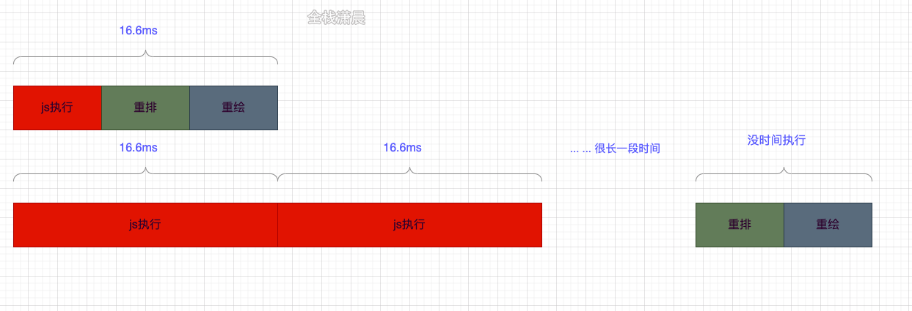
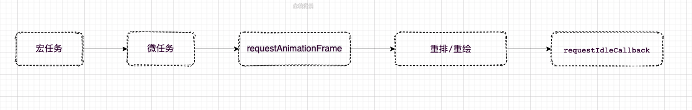
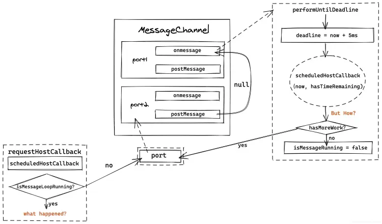

# React schedule&lane模型源码

## Scheduler
我们知道如果我们的应用占用较长的js执行时间，比如超过了设备一帧的时间，那么设备的绘制就会出现卡顿的现象。

Scheduler主要的功能是时间切片和调度优先级，react在对比差异的时候会占用一定的js执行时间，Scheduler内部借助MessageChannel实现了在浏览器绘制之前指定一个时间片，如果react在指定时间内没对比完，Scheduler就会强制交出执行权给浏览器



## 时间切片
​ 在浏览器的一帧中js的执行时间如下


​ **requestIdleCallback** 是在浏览器重绘重排之后，如果还有空闲就可以执行的时机，所以为了不影响重绘重排，可以在浏览器在requestIdleCallback中执行耗性能的计算，但是由于requestIdleCallback存在**兼容和触发时机不稳定**的问题，scheduler中采用MessageChannel来实现requestIdleCallback，当前环境不支持MessageChannel就采用setTimeout。

​ 在之前的介绍中我们知道在performUnitOfWork之后会执行render阶段和commit阶段，如果在浏览器的一帧中，cup的计算还没完成，就会让出js执行权给浏览器，这个判断在workLoopConcurrent函数中，shouldYield就是用来判断剩余的时间有没有用尽。在源码中每个时间片时5ms，这个值会根据设备的fps调整。


### forceFrameRate
根据显示器支持的fps来设置对应的时间切片间隔（**yieldInterval**）
```javaScript
function workLoopConcurrent() {
  while (workInProgress !== null && !shouldYield()) { // 判断剩余时间是否用尽
    performUnitOfWork(workInProgress);
  }
}
```
```javaScript
function forceFrameRate(fps) {//计算时间片
  if (fps < 0 || fps > 125) {
    console['error'](
      'forceFrameRate takes a positive int between 0 and 125, ' +
        'forcing frame rates higher than 125 fps is not supported',
    );
    return;
  }
  if (fps > 0) {
    yieldInterval = Math.floor(1000 / fps);
  } else {
    yieldInterval = 5;//时间片默认5ms
  }
}
```
## 任务的暂停

在shouldYield函数中有一段，所以可以知道，如果当前时间大于任务开始的时间+yieldInterval，就打断了任务的进行。

### getCurrentTime：
获取微秒级别的当前时间，并且不受系统时间影响。
```javaScript
// deadline = currentTime + yieldInterval
shouldYieldToHost = function () {
  return getCurrentTime() >= deadline;
}
```

## 通知调度
### requestHostCallback:
准备好当下要执行的任务（**scheduledHostCallback**），开启消息调度循环（**isMessageLoopRunning**），调用**performWorkUntilDeadline**（通过**postMessage**的方式）
```javaScript
const port = channel.port2; // port => port2
channel.port1.onmessage = performWorkUntilDeadline; // port1的回调监听设为 performWorkUntilDeadline;

requestHostCallback = function(callback) {
  scheduledHostCallback = callback;
  if (!isMessageLoopRunning) {
    isMessageLoopRunning = true;
    port.postMessage(null); // 通知port1执行回调 performWorkUntilDeadline
  }
};
```

### performWorkUntilDeadline：
消息通道监听消息的回调（Scheduler里面MessageChannel的port1被用来做回调，port2被用来专门postMessage），递归处理任务

```javaScript
const performWorkUntilDeadline = () => {
  if (scheduledHostCallback !== null) {
    const currentTime = getCurrentTime();
    deadline = currentTime + yieldInterval; // 过期时间 = 当前时间 + 时间间隔
    const hasTimeRemaining = true;
    try {
      const hasMoreWork = scheduledHostCallback(
        hasTimeRemaining,
        currentTime,
      );
      if (!hasMoreWork) { // 没有接下来的work，结束循环
        isMessageLoopRunning = false;
        scheduledHostCallback = null;
      } else {  // 如果还有多的work，继续通过postmessage通知调度上一个未完成的work
        port.postMessage(null);
      }
    } catch (error) {
      port.postMessage(null);
      throw error;
    }
  } else {
    isMessageLoopRunning = false;
  }
  // Yielding to the browser will give it a chance to paint, so we can
  // reset this.
  needsPaint = false;
};
```
任务调度控制函数在不同环境下会被处理成不同的异步任务
- setImmediate node环境下的check任务
- MessageChannel 浏览器环境下的微任务
- setTimeout 浏览器环境下的宏任务/node下的定时器任务

`performWorkUntilDeadline`会针对当前环境，去降级地对任务控制函数处理
```javaScript
if (typeof localSetImmediate === 'function') {
  // setImmediate
  schedulePerformWorkUntilDeadline = () => {
    localSetImmediate(performWorkUntilDeadline);
  };
} else if (typeof MessageChannel !== 'undefined') {
  // MessageChannel
  const channel = new MessageChannel();
  // ...
} else {
  // setTimeout
  schedulePerformWorkUntilDeadline = () => {
    localSetTimeout(performWorkUntilDeadline, 0);
  };
}
```

**整个MessageChannel实现任务循环的过程**


## 调度优先级

### runWithPriority：
以一个优先级执行callback，如果是同步的任务，优先级就是ImmediateSchedulerPriority
```javaScript
function unstable_runWithPriority(priorityLevel, eventHandler) {
  switch (priorityLevel) {//5种优先级
    case ImmediatePriority:
    case UserBlockingPriority:
    case NormalPriority:
    case LowPriority:
    case IdlePriority:
      break;
    default:
      priorityLevel = NormalPriority;
  }

  var previousPriorityLevel = currentPriorityLevel;//保存当前的优先级
  currentPriorityLevel = priorityLevel;//priorityLevel赋值给currentPriorityLevel

  try {
    return eventHandler();//回调函数
  } finally {
    currentPriorityLevel = previousPriorityLevel;//还原之前的优先级
  }
}
```

### scheduleCallback：
**整个Scheduler的调用入口**，以一个优先级注册callback，在适当的时机执行，因为涉及过期时间的计算，所以scheduleCallback比runWithPriority的粒度更细。

- 在scheduleCallback中优先级意味着过期时间，优先级越高**priorityLevel**就越小，过期时间离当前时间就越近，`var expirationTime = startTime + timeout`;例如**IMMEDIATE_PRIORITY_TIMEOUT=-1**，那`var expirationTime = startTime + (-1)`;就小于当前时间了，所以要立即执行。
- scheduleCallback调度的过程用到了**小顶堆**，所以我们可以在O(1)的复杂度找到优先级最高的task，不了解可以查阅资料，在源码中小顶堆存放着任务，每次peek都能取到离过期时间最近的task。
- scheduleCallback中会维护两个队列：
  - **timerQueue**：延期任务队列
  - **taskQueue**：将要执行的任务队列

​ 新建newTask任务之后，判断newTask是否过期，没过期就加入timerQueue中，如果此时taskQueue中还没有过期任务，timerQueue中离过期时间最近的task正好是newTask，则设置个定时器，到了过期时间就加入taskQueue中。

​ 当timerQueue中有任务，就取出最早过期的任务执行。

```javaScript
function unstable_scheduleCallback(priorityLevel, callback, options) {
  var currentTime = getCurrentTime();

  var startTime;//开始时间
  if (typeof options === 'object' && options !== null) {
    var delay = options.delay;
    if (typeof delay === 'number' && delay > 0) {
      startTime = currentTime + delay;
    } else {
      startTime = currentTime;
    }
  } else {
    startTime = currentTime;
  }

  var timeout;
  switch (priorityLevel) {
    case ImmediatePriority://优先级越高timeout越小
      timeout = IMMEDIATE_PRIORITY_TIMEOUT;//-1 
      break;
    case UserBlockingPriority:
      timeout = USER_BLOCKING_PRIORITY_TIMEOUT;//250
      break;
    case IdlePriority:
      timeout = IDLE_PRIORITY_TIMEOUT;
      break;
    case LowPriority:
      timeout = LOW_PRIORITY_TIMEOUT;
      break;
    case NormalPriority:
    default:
      timeout = NORMAL_PRIORITY_TIMEOUT;
      break;
  }

  var expirationTime = startTime + timeout;//优先级越高 过期时间越小

  var newTask = {//新建task
    id: taskIdCounter++,  // taskid
    callback: callback, // 回调函数
    priorityLevel: priorityLevel, // 任务优先级，优先级越高，timeout越小
    startTime: startTime, // 开始时间
    expirationTime: expirationTime, // 过期时间
    sortIndex: -1 //排序索引 默认为-1，实际会被设置成startTime或expirationTime
  };
  if (enableProfiling) {
    newTask.isQueued = false;
  }
  // timeQueue 未过期任务队列 taskQueue 过期任务队列
  if (startTime > currentTime) {
   // 开始时间startTime大于当前时间currentTime，说明存在延时delay任务
    newTask.sortIndex = startTime;
    push(timerQueue, newTask);//加入timerQueue
    //taskQueue中还没有过期任务，timerQueue中离过期时间最近的task正好是newTask
    if (peek(taskQueue) === null && newTask === peek(timerQueue)) {
      if (isHostTimeoutScheduled) {
        cancelHostTimeout();
      } else {
        isHostTimeoutScheduled = true;
      }
      //设置延时执行，到了过期时间就加入taskQueue中
      requestHostTimeout(handleTimeout, startTime - currentTime);
    }
  } else {
    newTask.sortIndex = expirationTime;
    push(taskQueue, newTask);//加入taskQueue
    if (enableProfiling) {
      markTaskStart(newTask, currentTime);
      newTask.isQueued = true;
    }
    if (!isHostCallbackScheduled && !isPerformingWork) {
      isHostCallbackScheduled = true;
      requestHostCallback(flushWork);//执行过期的任务
    }
  }

  return newTask;
}
```

### handleTimeout：
定时器的简单封装，根据任务队列是否为空，来决定是开始wookloop执行任务，还是重新调用handleTimeout来更新任务的延时时间/
```javaScript
function handleTimeout(currentTime) {
  // 将flag置为否
  isHostTimeoutScheduled = false;
  advanceTimers(currentTime); // 检查并将timerQueue中的过期的延时任务放进taskQueue中

  if (!isHostCallbackScheduled) {
    if (peek(taskQueue) !== null) {
      // 任务队列非空，执行flushwork 开始 workloop
      isHostCallbackScheduled = true;
      requestHostCallback(flushWork);
    } else {
      // 当前还是没有可处理任务的情况
      const firstTimer = peek(timerQueue);
      if (firstTimer !== null) {
        // 继续定时下一个延时任务的定时器时间，（更新延时时间）
        requestHostTimeout(handleTimeout, firstTimer.startTime - currentTime);
      }
    }
  }
}
```

## flushWork & workLoop & advanceTimers

### flushWork
任务循环发起者（让workLoop开始工作）
```javaScript
function flushWork(hasTimeRemaining, initialTime) {
  isHostCallbackScheduled = false;
  if (isHostTimeoutScheduled) {

    isHostTimeoutScheduled = false;
    cancelHostTimeout();
  }

  isPerformingWork = true;
  const previousPriorityLevel = currentPriorityLevel;
  try {
    // ...
    // 调用wookloop
    return workLoop(hasTimeRemaining, initialTime);
    // ...
  } finally {
    // 额外模块全局变量修改
    currentTask = null;
    currentPriorityLevel = previousPriorityLevel;
    isPerformingWork = false;
    // ...
  }
}
```

### workLoop
workloop会循环清空任务队列的任务
```javaScript
function workLoop(hasTimeRemaining, initialTime) {
  let currentTime = initialTime;
  // 检查并将timerQueue中将要过期的任务加入到taskQueue
  advanceTimers(currentTime);
  // 取出当前优先级最高的任务
  currentTask = peek(taskQueue);
  while (
    currentTask !== null &&
    !(enableSchedulerDebugging && isSchedulerPaused)
  ) {
    if (
      currentTask.expirationTime > currentTime &&
      (!hasTimeRemaining || shouldYieldToHost())
    ) {
      // 当任务过期时间超出当前时间 且 shouldYieldToHost判断当前需要将控制权交还给浏览器 结束当前循环
      break;
    }
    // 拿到回调函数 （performConcurrentWorkOnRoot / performSyncWorkOnRoot）
    const callback = currentTask.callback;
    if (typeof callback === 'function') {
      // callback存在且为函数
      currentTask.callback = null;
      currentPriorityLevel = currentTask.priorityLevel;
      const didUserCallbackTimeout = currentTask.expirationTime <= currentTime; // 回调函数是否会超时

      const continuationCallback = callback(didUserCallbackTimeout);
      currentTime = getCurrentTime();
      if (typeof continuationCallback === 'function') { // callback执行的结果可能会是个函数，这种情况我们之后讨论
        currentTask.callback = continuationCallback;  // callback赋值为continuationCallback，方便让后续wookloop继上次结束点继续执行未执行完的回调

      } else {
        if (currentTask === peek(taskQueue)) {
          // 弹出当前任务
          pop(taskQueue);
        }
      }
      advanceTimers(currentTime); // advanceTimers：将timerQueue中到达延时时间的任务放到taskQueue中
    } else {
      // callback不存在，说明回调已经执行完毕，currentTask可以弹出
      pop(taskQueue);
    }
    currentTask = peek(taskQueue);
  }

  if (currentTask !== null) {
    // taskQueue还存在任务，继续
    return true;
  } else {
    // taskQueue任务处理完了，更新timerQueue延时队列中任务的延时时间
    const firstTimer = peek(timerQueue);
    if (firstTimer !== null) {
      requestHostTimeout(handleTimeout, firstTimer.startTime - currentTime);
    }
    return false;
  }
}

```

### advanceTimers
管理任务队列里面任务的算法API：会检查并将timerQueue中的过期的延时任务放进taskQueue中
```javaScript
function advanceTimers(currentTime) {
  let timer = peek(timerQueue); // peek当前优先级最大的延时任务
  while (timer !== null) {
    if (timer.callback === null) {
      // Timer任务是否被取消.
      pop(timerQueue);
    } else if (timer.startTime <= currentTime) {
      // Timer任务开始时间已超时，塞入taskQueue
      pop(timerQueue);
      // 修改排序索引为 expirationTime
      timer.sortIndex = timer.expirationTime;
      push(taskQueue, timer);

    } else {
      // 剩余的延时任务都还在pending中
      return;
    }
    timer = peek(timerQueue);
  }
}
```

## Scheduler模块callback主体
我们知道Scheduler模块以**schduleCallback(*unstable_scheduleCallback*)** 为调用入口，来为callback注册优先级（定义过期时间）

而这个callback的主体是什么呢？

```javaScript
// workLoop
const callback = currentTask.callback;
//...
const continuationCallback = callback(didUserCallbackTimeout);

if (typeof continuationCallback === 'function') {
  currentTask.callback = continuationCallback;
} else {
  if (currentTask === peek(taskQueue)) {
   // 弹出当前任务
   pop(taskQueue);
  }
}
```
像是在wookloop我们碰到的对callback的判断，它可能是一个**回调函数**， 也可能是一个**返回值为接下来需要继续执行的回调函数**的函数

其实schedule中callback的主体主要就是**performConcurrentWorkOnRoot / performSyncWorkOnRoot**

### ensureRootIsScheduled
确保root处于调度阶段，其中根据react不同的模式调用了scheduleCallback注册了对应的回调**（*performConcurrentWorkOnRoot / performSyncWorkOnRoot*）**
```javaScript
function ensureRootIsScheduled(root: FiberRoot, currentTime: number) {
  // ...
  newCallbackNode = scheduleSyncCallback(
    performSyncWorkOnRoot.bind(null, root),
  );
  // ...concurrent
  newCallbackNode = scheduleCallback(
    schedulerPriorityLevel,
    performConcurrentWorkOnRoot.bind(null, root),
  );
  root.callbackPriority = newCallbackPriority;
  root.callbackNode = newCallbackNode;
}
```
### performConcurrentWorkOnRoot/performSyncWorkOnRoot的返回值
我们知道了callback的主体其实就是**performConcurrentWorkOnRoot/performSyncWorkOnRoot**，那么我们来看一下他们的返回值，因为前面提到callback还可以返回一个**接下来需要继续执行的回调函数**
```javaScript
if (root.callbackNode === originalCallbackNode) {
  // 当前root的callbackNode就是schedule当前调度的任务，需要恢复任务执行
  return performConcurrentWorkOnRoot.bind(null, root);
}
return null;
```
通过这段判断我们便可以验证wookloop中callback主体的性质，它可以是一个**回调函数**， 也可以**返回一个回调函数**，当返回的值为其自身（回调函数）时，可以视作是**一种中断前的状态保存**

## 总结

### 循环机制
通过 `performWorkUntilDeadline` 这个方法来实现一个递归的**消息发送-接收-处理流程**，可以看成是一个轮回，亦或者是一个**时间片**。

### 任务处理

接收到的任务被按照一定的优先级规则进行预设，然后通过`requestHostCallback`来开启循环机制，通过`scheduledHostCallback`开始处理一系列任务（`flushWork`），产生一个 while 循环（`workLoop`）来不断地**对队列中的内容进行处理**，这期间还会**逐步的将被递延任务从 timerQueue 中梳理（`advanceTimers`）到 taskQueue 中**，使得任务能按预设的优先级有序的执行。
