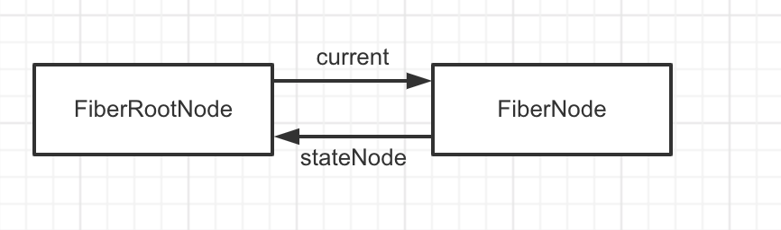
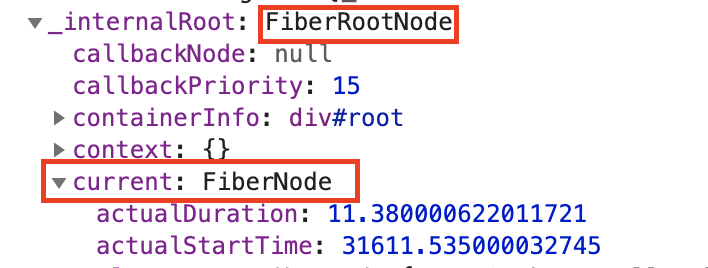
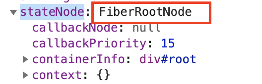
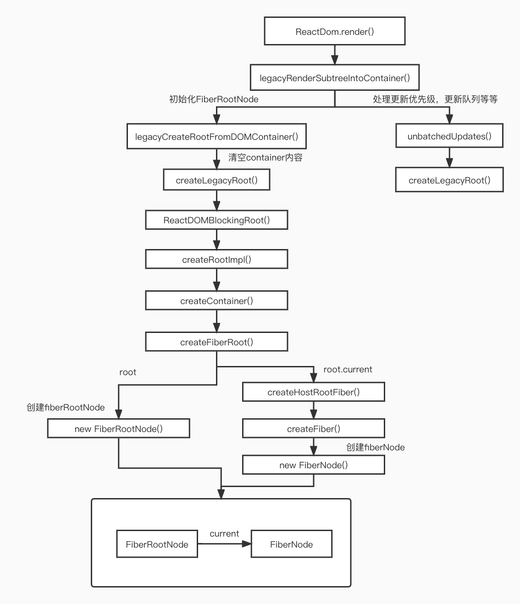

# React 初始化阶段源码解析:

## 初始化阶段：

首先我们知道React 通过ReactDom.render来渲染跟节点，那就从render函数来开始追溯。render函数位于packages/react-dom/src/client/ReactDOM.js 目录下暴露出

```js
export {
  ...
  // Disabled behind disableLegacyReactDOMAPIs
  findDOMNode,
  hydrate,
  render,
  unmountComponentAtNode,
  ...
};
```

### 1. **render函数：**

```js
export function render(
  element: React$Element<any>,	// 要挂载的app
  container: Container,	// 要挂载到的root节点
  callback: ?Function,
) {
  invariant(
    isValidContainer(container), // 判断容器是否合法
    'Target container is not a DOM element.',
  );
  if (__DEV__) {
    ...
  }
  return legacyRenderSubtreeIntoContainer(
    null,
    element,
    container,
    false,
    callback,
  );
}
```

先通过``isValidContainer``来判断容器是否合法，然后实际返回的是``legacyRenderSubtreeIntoContainer``调用结果。

**isValidContainer函数：**

```js
export function isValidContainer(node: mixed): boolean {
  // 其实就是判断节点的nodeType属性
  return !!(
    node &&
    (node.nodeType === ELEMENT_NODE ||
      node.nodeType === DOCUMENT_NODE ||
      node.nodeType === DOCUMENT_FRAGMENT_NODE ||
      (node.nodeType === COMMENT_NODE &&
        (node: any).nodeValue === ' react-mount-point-unstable '))
  );
}
```


#### 1.1 **legacyRenderSubtreeIntoContainer函数：**

```js
function legacyRenderSubtreeIntoContainer(
  parentComponent: ?React$Component<any, any>, // 首次渲染为null
  children: ReactNodeList, // <App />
  container: Container, // <div id="root"></div>
  forceHydrate: boolean, // 判断是否为服务端渲染 false
  callback: ?Function, // 回调函数
) {
  if (__DEV__) {
    ...
  }

  let root: RootType = (container._reactRootContainer: any);
  let fiberRoot; // Fiber根节点
  // 初始化的时候 root 为 undefined
  if (!root) {
    // 这里初始化了全局根节点fiberRootNode fiber节点fiberNode
    // 根节点的创建调用了legacyCreateRootFromDOMContainer函数，这里之后再介绍这个函数
    root = container._reactRootContainer = legacyCreateRootFromDOMContainer(
      container,
      forceHydrate,
    );
    fiberRoot = root._internalRoot;
    // 处理回调函数
    if (typeof callback === 'function') {
      const originalCallback = callback;
      callback = function() {
        const instance = getPublicRootInstance(fiberRoot);
        originalCallback.call(instance);
      };
    }
    // Initial mount should not be batched.
    // 当调用 unbatchedUpdates 的时候就会调用这个 updateContainer，去到 Reconciler 中处理更新优先级，更新队列等等问题。
    // 下面会把unbatchedUpdates，updateContainer 单独拎出来讲
    unbatchedUpdates(() => {
      updateContainer(children, fiberRoot, parentComponent, callback);
    });
  } else {
    // 这里是非初始化阶段的逻辑，除了初始化根节点的操作，其他逻辑基本没变
    fiberRoot = root._internalRoot;
    if (typeof callback === 'function') {
      const originalCallback = callback;
      callback = function() {
        const instance = getPublicRootInstance(fiberRoot);
        originalCallback.call(instance);
      };
    }
    // Update
    updateContainer(children, fiberRoot, parentComponent, callback);
  }
   // 最后
  // 返回当前fiberRoot的stateNode，有三种特殊情况
  // 1.对于FiberNode.current指向的FiberNode，stateNode 为 FiberRootNode
  // 2.FiberNode 下面的 App 组件中的 stateNode 为 null
  // 3.App组件下面，对于拥有真实dom节点的节点中的 stateNode 为 dom真实节点，这个最重要
  return getPublicRootInstance(fiberRoot);
}
```

##### 1.1.1 legacyCreateRootFromDOMContainer函数：

legacyCreateRootFromDOMContainer函数主要是拿着真实DOM创建一个ReactRoot并返回给container._reactRootContainer

```js
function legacyCreateRootFromDOMContainer(
  container: Container,
  forceHydrate: boolean,
): RootType {
  const shouldHydrate =
    forceHydrate || shouldHydrateDueToLegacyHeuristic(container);
  // First clear any existing content.
  // 判断是服务端还是浏览器端，非服务端清空内容，调用createLegacyRoot，去创建 _internalRoot对象
  if (!shouldHydrate) {
    let warned = false;
    let rootSibling;
    // 循环删除container的最后一个节点，直到清空
    while ((rootSibling = container.lastChild)) {
      if (__DEV__) {
        ...
      }
      container.removeChild(rootSibling);
    }
  }
  if (__DEV__) {
    ...
  }

  return createLegacyRoot(
    container,
    shouldHydrate
      ? {
          hydrate: true,
        }
      : undefined,
  );
}
```

###### 1.1.1.1 createLegacyRoot函数：

```js
export function createLegacyRoot(
  container: Container,
  options?: RootOptions,
): RootType {
  // 本质上就是回调了ReactDOMBlockingRoot，带上了节点类型LegacyRoot
  return new ReactDOMBlockingRoot(container, LegacyRoot, options);
  // ReactDOMBlockingRoot的方法体 this._internalRoot = createRootImpl(container, tag, options);
}
```

###### 1.1.1.2 createRootImpl函数：

```js
// 创建_internalRoot的方法
function createRootImpl(
  container: Container,
  tag: RootTag,
  options: void | RootOptions,
) {
    ...
  // 创建fiberRootNode, 下面将会展开
  const root = createContainer(container, tag, hydrate, hydrationCallbacks);
  markContainerAsRoot(root.current, container);
  const containerNodeType = container.nodeType;
  // 事件系统，忽略, export const enableEagerRootListeners = true
  if (enableEagerRootListeners) {
    ...
  } else {
    ...
  }

  if (mutableSources) {
    ...
    }
  }
  // 把刚刚创建的fiberRootNode返回
  return root;
}
```

有上面知道了是调用了``createContainer``来创建``fiberNode``，在 packages/react-reconciler/src/ReactFiberReconciler.js下的 ``createContainer`` 可以看到封装了层判断，根据``enableNewReconciler``来判断调用``createContainer_new``还是``createContainer_old``。**它设置这个的原因是为了新的版本和当前版本可以同时推进，但是打tag不能满足逻辑改动太大，所以就采用了使用文件做以区分**

###### 1.1.1.3 createContainer函数：

实际上就是把参数透传给``createFiberRoot``

```js
export function createContainer(
  containerInfo: Container,
  tag: RootTag,
  hydrate: boolean,
  hydrationCallbacks: null | SuspenseHydrationCallbacks,
): OpaqueRoot {
  return createFiberRoot(containerInfo, tag, hydrate, hydrationCallbacks);
}
```

###### 1.1.1.4 createFiberRoot函数：

```js
// packages/react-reconciler/src/ReactFiberRoot.old.js
export function createFiberRoot(
  containerInfo: any,
  tag: RootTag,
  hydrate: boolean,
  hydrationCallbacks: null | SuspenseHydrationCallbacks,
): FiberRoot {
  // 创建fiber节点， 下面展开
  const root: FiberRoot = (new FiberRootNode(containerInfo, tag, hydrate): any);
  if (enableSuspenseCallback) {
    root.hydrationCallbacks = hydrationCallbacks;
  }

  const uninitializedFiber = createHostRootFiber(tag);
  // 这里有一个循环引用，从这里看出来 FiberRootNode 和  FiberNode节点 的关系
  root.current = uninitializedFiber;
  uninitializedFiber.stateNode = root;
  // 初始化更新链表
  initializeUpdateQueue(uninitializedFiber);

  return root;
}

```

FiberRootNode 与 FiberNode的循环引用结构



FiberRootNode结构：



FiberNode结构：



###### 1.1.1.4.1 FiberRootNode函数:

这里才是真正创建fiberRootNode的地方：

```js
function FiberRootNode(containerInfo, tag, hydrate) {
  this.tag = tag; // 0
  this.containerInfo = containerInfo; // <div id="root></div>
  //当前应用root节点对应的Fiber对象，即Root Fiber，ReactElement会有一个树结构，同时一个ReactElement对应一个Fiber对象，所以Fiber也会有树结构
  this.pendingChildren = null;
  this.current = null; // fiberNode，这里是第一个fiber的起点，即是app组件的父亲
  // WeakMap<Wakeable, Set<mixed>> | Map<Wakeable, Set<mixed>> | null,
  // 任务有三种，优先级有高低：
  // 1.没有提交的任务
  // 2.没有提交的被挂起的任务
  // 3.没有提交的可能被挂起的任务
  this.pingCache = null;
  // 已经完成任务的FiberRoot对象，如果你只有一个Root，那么该对象就是这个Root对应的Fiber或null
  // 在commit(提交)阶段只会处理该值对应的任务
  this.finishedWork = null;
  // 在任务被挂起的时候，通过setTimeout设置的响应内容，
  // 并且清理之前挂起的任务 还没触发的timeout
  this.timeoutHandle = noTimeout;
  // 顶层context对象，只有主动调用renderSubtreeIntoContainer才会生效
  // context: Object | null,
  this.context = null;
  this.pendingContext = null; // 服务端相关
  this.hydrate = hydrate; // false
  this.callbackNode = null; // 默认是最高级的回调函数
  this.callbackPriority = NoLanePriority; // 0
  this.eventTimes = createLaneMap(NoLanes);
  this.expirationTimes = createLaneMap(NoTimestamp);

  // 这里的优先级全是最高级
  this.pendingLanes = NoLanes;
  this.suspendedLanes = NoLanes;
  this.pingedLanes = NoLanes;
  this.expiredLanes = NoLanes;
  this.mutableReadLanes = NoLanes;
  this.finishedLanes = NoLanes;

  this.entangledLanes = NoLanes;
  this.entanglements = createLaneMap(NoLanes);

  // 服务端相关
  if (supportsHydration) {
    this.mutableSourceEagerHydrationData = null;
  }

  if (enableSchedulerTracing) {
    this.interactionThreadID = unstable_getThreadID();
    this.memoizedInteractions = new Set();
    this.pendingInteractionMap = new Map();
  }
  if (enableSuspenseCallback) {
    this.hydrationCallbacks = null;
  }

  if (__DEV__) {
    ...
  }
}

```

###### 1.1.1.4.2 createHostRootFiber函数：

```js
// packages/react-reconciler/src/ReactFiber.old.js
export function createHostRootFiber(tag: RootTag): Fiber { // tag = 0
  let mode;
  if (tag === ConcurrentRoot) {
    mode = ConcurrentMode | BlockingMode | StrictMode;
  } else if (tag === BlockingRoot) {
    mode = BlockingMode | StrictMode;
  } else {
    mode = NoMode; // 初始化得到0
  }

  if (enableProfilerTimer && isDevToolsPresent) {
    mode |= ProfileMode; // 8
  }
  // HostRoot：3  ProfileMode：8
  return createFiber(HostRoot, null, null, mode); // fiberNode
}
```

###### 1.1.1.4.2.1 createFiber函数：

```js
// packages/react-reconciler/src/ReactFiber.old.js
const createFiber = function(
  tag: WorkTag,	// 3
  pendingProps: mixed, // null
  key: null | string, // null
  mode: TypeOfMode, // 8
): Fiber {
  // 创建 fiberNode
  return new FiberNode(tag, pendingProps, key, mode);
};
```

###### 1.1.1.4.2.2 FiberNode函数:

```js
// 创建fiber节点
function FiberNode(
  tag: WorkTag, // 3
  pendingProps: mixed, // null
  key: null | string, // null
  mode: TypeOfMode, // 8
) {
  // Instance
  this.tag = tag; // 定fiber的类型。在reconciliation算法中使用它来确定需要完成的工作
  this.key = key; // 唯一标识符
  this.elementType = null;
  this.type = null;// 定义与fiber关联的功能或类。对于类组件，它指向构造函数，对于DOM元素，它指向HTML标记。
  this.stateNode = null; // 一般视为真实节点，即使有时候不是

  // Fiber
  this.return = null; // 指向父节点
  this.child = null; // 指向子节点
  this.sibling = null; // 指向兄弟节点
  this.index = 0; // 在这么多兄弟中排行第几

  this.ref = null; // 操作dom方法

  this.pendingProps = pendingProps; // 新变动带来的新props，即nextProps
  this.memoizedProps = null; // 更新前的Props
  this.updateQueue = null; // 状态更新，回调和DOM更新的队列，Fiber对应的组件，所产生的update，都会放在该队列中
  this.memoizedState = null; // hooks链表
  this.dependencies = null; // 一个列表，存在该Fiber依赖的contexts，events

  this.mode = mode; // fiber树上节点mode都是8， 继承父节点

  // Effects
  this.flags = NoFlags; // 当前fiber阶段需要进行任务，包括：占位、更新、删除等，一般发生在diff的时候打上标记
  this.nextEffect = null; // 记录副作用

  this.firstEffect = null; // 同上
  this.lastEffect = null; // 同上

  this.lanes = NoLanes; // 优先级
  this.childLanes = NoLanes; // child优先级

  this.alternate = null; // current fiber指向work in progress fiber;working in progress fiber指向current fiber

  if (enableProfilerTimer) {
        // 注意：这里为什么会出现赋值两次呢，这个问题参考下面的链接，我的理解是，getHostSibling方法使用到这些变量的时候，会缓慢，这对于chrome来说也是一种奇怪的行为，但是解决的方式是先赋值  Number.NaN 或 Number.MIN_VALUE才赋上真正的值，值得一提的是这是18年初提出的问题，到现在都还没解决。
    this.actualDuration = Number.NaN;
    this.actualStartTime = Number.NaN;
    this.selfBaseDuration = Number.NaN;
    this.treeBaseDuration = Number.NaN;

    this.actualDuration = 0;
    this.actualStartTime = -1;
    this.selfBaseDuration = 0;
    this.treeBaseDuration = 0;
  }

  if (__DEV__) {
    // This isn't directly used but is handy for debugging internals:
    this._debugID = debugCounter++;
    this._debugSource = null;
    this._debugOwner = null;
    this._debugNeedsRemount = false;
    this._debugHookTypes = null;
    if (!hasBadMapPolyfill && typeof Object.preventExtensions === 'function') {
      Object.preventExtensions(this);
    }
  }
}
```

至此，初始化的fiber已经创建完毕

#### 1.2 unbatchedUpdates 和 updateContainer：

**unbatchedUpdates()**

```js
// packages/react-reconciler/src/ReactFiberWorkLoop.old.js
export function unbatchedUpdates<A, R>(fn: (a: A) => R, a: A): R {
  // 对上下文处理
  const prevExecutionContext = executionContext;
  executionContext &= ~BatchedContext;
  executionContext |= LegacyUnbatchedContext;
  try {
    // 直接调用了传入的回调函数 fn，也就是updateContainer
    return fn(a);
  } finally {
    // 将上下文复原
    executionContext = prevExecutionContext;
    if (executionContext === NoContext) {
      // Flush the immediate callbacks that were scheduled during this batch
      resetRenderTimer(); // 设置时间  === workInProgressRootRenderTargetTime = now() + RENDER_TIMEOUT_MS;
      // 刷新回调
      flushSyncCallbackQueue();
    }
  }
}
```

**updateContainer()**

```js
export function updateContainer(
  element: ReactNodeList, // <App/>
  container: OpaqueRoot, // FiberRootNode
  parentComponent: ?React$Component<any, any>, // null
  callback: ?Function, // undefined
): Lane {
  const current = container.current; // FiberRootNode.current 也就是FiberNode
  const eventTime = requestEventTime(); // 当前时间
  // 是一个定义优先级模型，这里是通过各种判断后，返回lane
  const lane = requestUpdateLane(current);
	...
  const context = getContextForSubtree(parentComponent);
  if (container.context === null) {
    container.context = context;
  } else {
    container.pendingContext = context;
  }
  // 创建 update 对象，一个 update 对象代表着一个更新
  const update = createUpdate(eventTime, lane);
  ...
  // 将update插入fiber.updateQueue.shared.pending上
  enqueueUpdate(current, update);
  // 调度节点，current节点即 fiberNode，开启render阶段，下面会展开。
  scheduleUpdateOnFiber(current, lane, eventTime);

  return lane;
}
```

## 小结：

综上，就是大概`React` 初始化阶段做了什么事情，主要初始化一下fiber信息，以及后续需要用到的各种字段，事件等等。

以下是整个初始化的大致流程：


