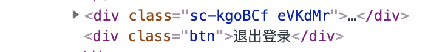
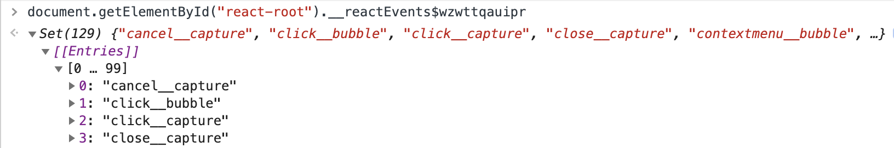

# React合成事件源码
> React在在原生事件的基础上封装了自己的一套合成事件模型。同时为了优化性能，采用时间委托的方式，将所有事件统一由根节点代理，同时React又自己实现了一条套事件的冒泡、捕获模型。

## 原理简述
React中事件分为委托事件 **（DelegatedEvent）** 和不需要委托事件 **（NonDelegatedEvent）**，委托事件在 **fiberRoot创建** 的时候，就会在root节点的DOM元素上绑定几乎所有事件的处理函数，而不需要委托事件只会将处理函数绑定在DOM元素本身。

同时，React将事件分为3种类型——`discreteEvent`、`userBlockingEvent`、`continuousEvent`，它们拥有不同的优先级，在绑定事件处理函数时会使用不同的回调函数。

## 事件绑定
**我们在代码中会看到事件是这样绑定的：**
```html
<div onClick={this.handleClick}>点击</div>
```
react通过on{事件名}来绑定事件，这样看似乎事件是绑定在元素上的，但当我们查看源代码时，并不能在节点上看到事件的绑定


首先我们先来看到合成事件系统的绑定：
```javaScript
// packages/react-dom/src/client/ReactDOMRoot.js
function createRootImpl(
  container: Container,
  tag: RootTag,
  options: void | RootOptions,
) {
  if (enableEagerRootListeners) {
    const rootContainerElement =
      container.nodeType === COMMENT_NODE ? container.parentNode : container; // 项目根节点，事件系统会绑定到根节点上，监听所有支持的事件
    listenToAllSupportedEvents(rootContainerElement); // 事件系统
  } else {
    // ...
  }
}
```
### listenToAllSupportedEvents
```javaScript
// packages/react-dom/src/events/DOMPluginEventSystem.js
export function listenToAllSupportedEvents(rootContainerElement: EventTarget) {
  if (enableEagerRootListeners) {
    // allNativeEvents Set数据类型 包含所有原生事件对象
    allNativeEvents.forEach(domEventName => {
      if (!nonDelegatedEvents.has(domEventName)) {
        listenToNativeEvent(
          domEventName,
          false,
          ((rootContainerElement: any): Element),
          null,
        );
      }
      listenToNativeEvent(
        domEventName,
        true,
        ((rootContainerElement: any): Element),
        null,
      );
    });
  }
}
```
allNativeEvents的赋值在DOMPluginEventSystem.js这个文件的最顶端：
```javaScript
import {registrationNameDependencies, allNativeEvents} from './EventRegistry';
// ...
import * as BeforeInputEventPlugin from './plugins/BeforeInputEventPlugin';
import * as ChangeEventPlugin from './plugins/ChangeEventPlugin';
import * as EnterLeaveEventPlugin from './plugins/EnterLeaveEventPlugin';
import * as SelectEventPlugin from './plugins/SelectEventPlugin';
import * as SimpleEventPlugin from './plugins/SimpleEventPlugin';

SimpleEventPlugin.registerEvents();
EnterLeaveEventPlugin.registerEvents();
ChangeEventPlugin.registerEvents();
SelectEventPlugin.registerEvents();
BeforeInputEventPlugin.registerEvents();
```

我们以`SimpleEventPlugin`的`registerEvents`为例：

#### SimpleEventPlugin.registerEvents()：

```javaScript
// packages/react-dom/src/events/plugins/SimpleEventPlugin.js
// SimpleEventPlugin的注册函数是从DOMEventProperties中导出的registerSimpleEvents方法
import {
  // ...
  registerSimpleEvents,
} from '../DOMEventProperties';
// ...
export {registerSimpleEvents as registerEvents, extractEvents};

// packages/react-dom/src/events/DOMEventProperties.js
// 优先级： DiscreteEvent: 0 UserBlockingEvent: 1 ContinuousEvent: 2
export function registerSimpleEvents() {
  registerSimplePluginEventsAndSetTheirPriorities(
    discreteEventPairsForSimpleEventPlugin,   // [cancel, close, click...]
    DiscreteEvent,
  );
  registerSimplePluginEventsAndSetTheirPriorities(
    userBlockingPairsForSimpleEventPlugin,  // [drag, dragenter, dragexit...]
    UserBlockingEvent,
  );
  registerSimplePluginEventsAndSetTheirPriorities(
    continuousPairsForSimpleEventPlugin,  // [abort, canplay, canplaythrough...]
    ContinuousEvent,
  );
  setEventPriorities(otherDiscreteEvents, DiscreteEvent);
}
```

#### registerSimplePluginEventsAndSetTheirPriorities:
```javaScript
// 添加注册事件并设置事件优先级
function registerSimplePluginEventsAndSetTheirPriorities(
  eventTypes: Array<DOMEventName | string>,
  priority: EventPriority,
): void {
  for (let i = 0; i < eventTypes.length; i += 2) {
    const topEvent = ((eventTypes[i]: any): DOMEventName);
    const event = ((eventTypes[i + 1]: any): string);
    const capitalizedEvent = event[0].toUpperCase() + event.slice(1);
    const reactName = 'on' + capitalizedEvent;
    eventPriorities.set(topEvent, priority);
    topLevelEventsToReactNames.set(topEvent, reactName);
    // registerTwoPhaseEvent函数内部最终会调用到registerDirectEvent
    registerTwoPhaseEvent(reactName, [topEvent]);
  }
}
```

在调用每个插件的registerEvents注册事件时，底层都会在内部最终调用到EventRegistry.js下的registerDirectEvent函数，来插入原生事件
```javaScript
// packages/react-dom/src/events/EventRegistry.js
export const allNativeEvents: Set<DOMEventName> = new Set();
export function registerDirectEvent(
  registrationName: string,
  dependencies: Array<DOMEventName>,
) {
  registrationNameDependencies[registrationName] = dependencies;
  for (let i = 0; i < dependencies.length; i++) {
    allNativeEvents.add(dependencies[i]);
  }
}
```

在搞清楚 allNativeEvents 的来源后我们继续往下看到listenToNativeEvent

### listenToNativeEvent
```javaScript
// 监听原生事件
export function listenToNativeEvent(
  domEventName: DOMEventName,
  isCapturePhaseListener: boolean,
  rootContainerElement: EventTarget,
  targetElement: Element | null,
  eventSystemFlags?: EventSystemFlags = 0,
): void {
  // 新建/获取rootContainerElement上的事件监听Set
  // rootContainerElement 上一个属性名为__reactEvents$xxx的对象
  const listenerSet = getEventListenerSet(target);
  // 需要绑定的事件监听key
  const listenerSetKey = getListenerSetKey(
    domEventName,
    isCapturePhaseListener,
  );
  // 在支持的事件监听Set中找到需要指定的事件监听
  if (!listenerSet.has(listenerSetKey)) {
    // 是否启用补货
    if (isCapturePhaseListener) {
      eventSystemFlags |= IS_CAPTURE_PHASE;
    }
    // 添加合成事件
    addTrappedEventListener(
      target,
      domEventName,
      eventSystemFlags,
      isCapturePhaseListener,
    );
    listenerSet.add(listenerSetKey);
  }
}
```
#### listenerSet
react所有绑定事件的key集合，这个集合存在于reactRootContainer的__reactEvents${随机字符串}属性上：



```javaScript
const internalEventHandlersKey = '__reactEvents$' + randomKey;
//...
export function getEventListenerSet(node: EventTarget): Set<string> {
  let elementListenerSet = (node: any)[internalEventHandlersKey];
  if (elementListenerSet === undefined) {
    elementListenerSet = (node: any)[internalEventHandlersKey] = new Set();
  }
  return elementListenerSet;
}
```
可以看到事件名由事件类型和事件处理阶段拼接而成，且listenerSet是由getListenerSetKey来获取到事件key：
```javaScript
export function getListenerSetKey(
  domEventName: DOMEventName,
  capture: boolean,
): string {
  return `${domEventName}__${capture ? 'capture' : 'bubble'}`;
}
```

### addTrappedEventListener
```javaScript
// packages/react-dom/src/events/DOMPluginEventSystem.js
function addTrappedEventListener(
  targetContainer: EventTarget,
  domEventName: DOMEventName,
  eventSystemFlags: EventSystemFlags,
  isCapturePhaseListener: boolean,
  isDeferredListenerForLegacyFBSupport?: boolean,
) {
// 特别注意这个地方 对事件的回调函数作了一次包装 稍后在事件触发阶段再来详细聊聊
  let listener = createEventListenerWrapperWithPriority(
    targetContainer,
    domEventName,
    eventSystemFlags,
  );
  let unsubscribeListener;
  if (isCapturePhaseListener) {
    unsubscribeListener = addEventCaptureListener(
        targetContainer,
        domEventName,
        listener,
      );
  } else {
    unsubscribeListener = addEventBubbleListener(
        targetContainer,
        domEventName,
        listener,
      );
  }
}
```
最后后我们再来到最终绑定事件的地方：
```javaScript
export function addEventBubbleListener(
  target: EventTarget,
  eventType: string,
  listener: Function,
): Function {
  target.addEventListener(eventType, listener, false);
  return listener;
}

export function addEventCaptureListener(
  target: EventTarget,
  eventType: string,
  listener: Function,
): Function {
  target.addEventListener(eventType, listener, true);
  return listener;
}
```
以上就是事件绑定全部流程，我们来小结一下：  

主要是对事件的捕获和冒泡阶段进行分别绑定，eventType 指的是事件类型，target 就是指的是我们应用程序的根节点，这里与16版本的区别主要是：

1. 17版本是将事件委托到了根节点上，这样有利于微前端的应用。
2. 17版本是将所有合法事件在应用程序初始化的时候都绑定上了，而16版本是按需绑定，因此在16版本react事件与原生事件有一个映射关系，比如 onChange:[blur,input,focus...]。

## 事件触发
在进行下面内容之前，我们最好得先有一个思维模型：

- 在上个阶段根节点绑定的原生事件中回调函数，其实是经过react底层包装过的，DOM事件流：捕获阶段 ===> 目标阶段 ===> 冒泡阶段，react其实是在底层模拟了这些过程。
- 事件执行是收集react元素上的事件监听；因此如果原生事件如果阻止了事件冒泡，那么后续的收集过程也就不执行了，自然react事件也就不执行了。

现在我们回到上面提到过的`packages/react-dom/src/events/DOMPluginEventSystem.js 文件`，

### createEventListenerWrapperWithPriority
```javaScript
export function createEventListenerWrapperWithPriority(
  targetContainer: EventTarget,
  domEventName: DOMEventName,
  eventSystemFlags: EventSystemFlags,
): Function {
  const eventPriority = getEventPriorityForPluginSystem(domEventName);
  let listenerWrapper;
  switch (eventPriority) {
    case DiscreteEvent:
      listenerWrapper = dispatchDiscreteEvent;
      break;
    case UserBlockingEvent:
      listenerWrapper = dispatchUserBlockingUpdate;
      break;
    case ContinuousEvent:
    default:
      listenerWrapper = dispatchEvent;  // 所有监听事件的回调函数
      break;
  }
  return listenerWrapper.bind(
    null,
    domEventName,
    eventSystemFlags,
    targetContainer,
  );
}
```
先忽略事件优先级的判断，因此我们将关注点放在 dispatchEvent 这个方法，可以得知该方法是**所有监听事件的回调函数**，通过bind传入了额外的参数，我们来看看这个方法的具体实现：

### dispatchEvent
```javaScript
// packages/react-dom/src/events/ReactDOMEventListener.js
export function dispatchEvent(
  domEventName: DOMEventName,
  eventSystemFlags: EventSystemFlags,
  targetContainer: EventTarget,
  nativeEvent: AnyNativeEvent,
): void {
  if (!_enabled) {
    return;
  }
// 此处是根据dom查找对应fiber的关键
  const blockedOn = attemptToDispatchEvent(
    domEventName,
    eventSystemFlags,
    targetContainer,
    nativeEvent,
  );

  if (blockedOn === null) {
    // We successfully dispatched this event.
    if (allowReplay) {
      clearIfContinuousEvent(domEventName, nativeEvent);
    }
    return;
  }

  dispatchEventForPluginEventSystem(
    domEventName,
    eventSystemFlags,
    nativeEvent,
    null,
    targetContainer,
  );
}
```
首先来看看接收的参数 domEventName、eventSystemFlags、targetContainer 这三个参数是通过上面的 bind 方法传入的，nativeEvent 则是原生的事件对象。在这个方法中执行 attemptToDispatchEvent 这里会尝试添加派发事件

### attemptToDispatchEvent
```javaScript
// packages/react-dom/src/events/ReactDOMEventListener.js
export function attemptToDispatchEvent(
  domEventName: DOMEventName,
  eventSystemFlags: EventSystemFlags,
  targetContainer: EventTarget,
  nativeEvent: AnyNativeEvent,
): null | Container | SuspenseInstance {
  const nativeEventTarget = getEventTarget(nativeEvent); // 获取触发原生事件的target
  let targetInst = getClosestInstanceFromNode(nativeEventTarget); // 获取到最近的节点fiber实例

  dispatchEventForPluginEventSystem(
    domEventName,
    eventSystemFlags,
    nativeEvent,
    targetInst,
    targetContainer,
  );
  // We're not blocked on anything.
  return null;
}
```
注意这个函数 getClosestInstanceFromNode：从真实dom中找到对应的fiber，具体是怎么做的呢？

### getClosestInstanceFromNode
```javaScript
export function getClosestInstanceFromNode(targetNode: Node): null | Fiber {
  let targetInst = (targetNode: any)[internalInstanceKey];
  if (targetInst) {
    return targetInst;
  }
  let parentNode = targetNode.parentNode;
  while (parentNode) {
    targetInst =
      (parentNode: any)[internalContainerInstanceKey] ||
      (parentNode: any)[internalInstanceKey];
    if (targetInst) {
      const alternate = targetInst.alternate;
      // ...
      return targetInst;
    }
    targetNode = parentNode;
    parentNode = targetNode.parentNode;
  }
  return null;
}
```
可以看到getClosestInstanceFromNode方法回去递归查找target节点的父节点，知道找到存在有`internalContainerInstanceKey`或`internalInstanceKey`属性的节点，便返回

而这个`internalContainerInstanceKey`或`internalInstanceKey`又是哪儿来的呢？这个key是在创建对应dom元素的方法中定义的

```javaScript
// packages/react-dom/src/client/ReactDOMHostConfig.js
export function createInstance(
  type: string,
  props: Props,
  rootContainerInstance: Container,
  hostContext: HostContext,
  internalInstanceHandle: Object,
): Instance {
  const domElement: Instance = createElement(
    type,
    props,
    rootContainerInstance,
    parentNamespace,
  );
  precacheFiberNode(internalInstanceHandle, domElement);
  updateFiberProps(domElement, props);
  return domElement;
}

// packages/react-dom/src/client/ReactDOMComponentTree.js
const randomKey = Math.random()
  .toString(36)
  .slice(2);
const internalInstanceKey = '__reactFiber$' + randomKey;

export function precacheFiberNode(
  hostInst: Fiber,
  node: Instance | TextInstance | SuspenseInstance | ReactScopeInstance,
): void {
  (node: any)[internalInstanceKey] = hostInst;
}
```
其实就是在处理fiber的complete阶段中在真实dom节点上添加了一个 internalInstanceKey 属性指向对应的fiber节点。记住这里，下文要用到。

回到事件派发，接着往下：
### dispatchEventForPluginEventSystem
```javaScript
export function dispatchEventForPluginEventSystem(
  domEventName: DOMEventName,
  eventSystemFlags: EventSystemFlags,
  nativeEvent: AnyNativeEvent,
  targetInst: null | Fiber,
  targetContainer: EventTarget,
): void {
  let ancestorInst = targetInst;

  batchedEventUpdates(() =>
  dispatchEventsForPlugins(
    domEventName,
    eventSystemFlags,
    nativeEvent,
    ancestorInst,
    targetContainer,
  ),
);
}
```
注意这里有批量更新的处理就是这里 batchedEventUpdates ，比如我们在点击事件中多次setState，在这里都是都会做一次批量处理合成一次.

### dispatchEventsForPlugins
```javaScript
function dispatchEventsForPlugins(
  domEventName: DOMEventName,
  eventSystemFlags: EventSystemFlags,
  nativeEvent: AnyNativeEvent,
  targetInst: null | Fiber,
  targetContainer: EventTarget,
): void {
  const nativeEventTarget = getEventTarget(nativeEvent);
  const dispatchQueue: DispatchQueue = [];
  extractEvents(
    dispatchQueue,
    domEventName,
    targetInst,
    nativeEvent,
    nativeEventTarget,
    eventSystemFlags,
    targetContainer,
  );
  processDispatchQueue(dispatchQueue, eventSystemFlags);
}
```
在这里我们需要关注两个地方：dispatchQueue、extractEvents
- dispatchQueue这个变量储存的是需要触发的事件队列。
- 同时我们也终于看到了react合成事件的核心了：**extractEvents**，还记得文章的开头讲的event事件对象其实并不是原生的，而是经过react底层包装过的。

### extractEvents
```javaScript
function extractEvents(
  dispatchQueue: DispatchQueue,
  domEventName: DOMEventName,
  targetInst: null | Fiber,
  nativeEvent: AnyNativeEvent,
  nativeEventTarget: null | EventTarget,
  eventSystemFlags: EventSystemFlags,
  targetContainer: EventTarget,
) {

  SimpleEventPlugin.extractEvents(
    dispatchQueue,
    domEventName,
    targetInst,
    nativeEvent,
    nativeEventTarget,
    eventSystemFlags,
    targetContainer,
  );
  // ...
}
```
在这个函数中解释了，react为什么要引入事件插件的原因？因为在不同类型的事件中，比如onClick,onChange的事件对象中需要进行不同的处理（polyfill）。
```javaScript
// packages/react-dom/src/events/plugins/SimpleEventPlugin.js
function extractEvents(
  dispatchQueue: DispatchQueue,
  domEventName: DOMEventName,
  targetInst: null | Fiber,
  nativeEvent: AnyNativeEvent,
  nativeEventTarget: null | EventTarget,
  eventSystemFlags: EventSystemFlags,
  targetContainer: EventTarget,
): void {
  const reactName = topLevelEventsToReactNames.get(domEventName);
  if (reactName === undefined) {
    return;
  }
  let SyntheticEventCtor = SyntheticEvent;
  let reactEventType: string = domEventName;

  const inCapturePhase = (eventSystemFlags & IS_CAPTURE_PHASE) !== 0;
  if (
    enableCreateEventHandleAPI &&
    eventSystemFlags & IS_EVENT_HANDLE_NON_MANAGED_NODE
  ) {
   // 略...
  } else {
    const accumulateTargetOnly =
      !inCapturePhase && domEventName === 'scroll';
// 根据对应fiber向上递归找到整个react事件队列
    const listeners = accumulateSinglePhaseListeners(
      targetInst,
      reactName,
      nativeEvent.type,
      inCapturePhase,
      accumulateTargetOnly,
    );
    if (listeners.length > 0) {
      const event = new SyntheticEventCtor(
        reactName,
        reactEventType,
        null,
        nativeEvent,
        nativeEventTarget,
      );
      dispatchQueue.push({event, listeners});
    }
  }
}
```
这里我们需要关注这几个地方：
1. accumulateSinglePhaseListeners 函数执行结果得到元素上的所有react事件，比如onClick、onChange。
2. 合成event事件对象构造函数 SyntheticEventCtor；

先来看accumulateSinglePhaseListeners函数：

### accumulateSinglePhaseListeners

```javaScript
// packages/react-dom/src/events/DOMPluginEventSystem.js
export function accumulateSinglePhaseListeners(
  targetFiber: Fiber | null,
  reactName: string | null,
  nativeEventType: string,
  inCapturePhase: boolean,
  accumulateTargetOnly: boolean,
): Array<DispatchListener> {
  const captureName = reactName !== null ? reactName + 'Capture' : null;
  const reactEventName = inCapturePhase ? captureName : reactName;
  const listeners: Array<DispatchListener> = [];

  let instance = targetFiber;
  let lastHostComponent = null;

  while (instance !== null) {
    const {stateNode, tag} = instance;
    if (tag === HostComponent && stateNode !== null) {
      lastHostComponent = stateNode;
      // Standard React on* listeners, i.e. onClick or onClickCapture
      if (reactEventName !== null) {
        const listener = getListener(instance, reactEventName);
        if (listener != null) {
          listeners.push(
            createDispatchListener(instance, listener, lastHostComponent),
          );
        }
      }
    }
    if (accumulateTargetOnly) {
      break;
    }
    instance = instance.return;
  }
  return listeners;
}
```
