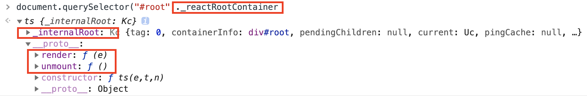

# React数据结构：

## ReactElement结构:

```js
export type Source = {|
  fileName: string,
  lineNumber: number,
|};

export type ReactElement = {|
  // 元素唯一标识符
  $$typeof: any,
  // 元素内置属性
  type: any,
  key: any,
  ref: any,
  props: any,
  // ReactFiber
  _owner: any,

  // __DEV__
  _store: {validated: boolean, ...},
  _self: React$Element<any>,
  _shadowChildren: any,
  _source: Source,
|};
```

## ReactRoot结构：

挂载``dom``的``_reactRootContainer``属性就是ReactRoot

ReactRoot的结构如下：包含**_internalRoot**属性指向**FiberRootNode**，同时原型上挂载了**render**方法和**unmount**方法



## FiberRoot结构：

```js
type BaseFiberRootProperties = {|
  tag: RootTag,	

  containerInfo: any,	// 指向挂载容器的真实dom
  pendingChildren: any,
  current: Fiber, // 指向Fiber根节点 也就是<App>
	...
  finishedWork: Fiber | null,	// 指向当前已经完成准备工作的Fiber Tree Root
	...
|};
```

## Fiber节点结构：

```js
function FiberNode(
  tag: WorkTag,
  pendingProps: mixed,
  key: null | string,
  mode: TypeOfMode,
) {

  // Fiber元素的静态属性相关
  this.tag = tag; // 组件对象类型
  this.key = key; // fiber的key
  this.elementType = null;
  this.type = null; // fiber对应的DOM元素的标签类型，div、p...
  this.stateNode = null; // fiber的实例，类组件场景下，是组件的类实例，HostComponent场景，是dom元素

  // Fiber 链表相关
  this.return = null; // 指向父级fiber
  this.child = null; // 指向子fiber
  this.sibling = null; // 同级兄弟fiber
  this.index = 0;

  this.ref = null; // ref相关

  // Fiber更新相关
  this.pendingProps = pendingProps; // 组件初始化props
  this.memoizedProps = null;
  this.updateQueue = null; // 存储update的链表
  this.memoizedState = null; // 类组件存储fiber的状态，函数组件存储hooks链表
  this.dependencies = null;

  this.mode = mode;

  // Effects
  // flags原为effectTag，表示当前这个fiber节点变化的类型：增、删、改
  this.flags = NoFlags;
  // effect链相关，也就是那些需要更新的fiber节点
  this.nextEffect = null;
  this.firstEffect = null;
  this.lastEffect = null;

  this.lanes = NoLanes; // 该fiber中的优先级，它可以判断当前节点是否需要更新
  this.childLanes = NoLanes;// 子树中的优先级，它可以判断当前节点的子树是否需要更新

  /*
  * 可以看成是workInProgress（或current）树中的和它一样的节点，
  * 可以通过这个字段是否为null判断当前这个fiber处在更新还是创建过程
  * */
  this.alternate = null;

}

```

## Update结构：

```js
// ClassComponent和HostRoot 类型的Update
export type Update<State> = {
  eventTime: number, // 任务时间，通过performance.now()获取的毫秒数。
  lane: Lane, // 更新优先级
  tag: 0 | 1 | 2 | 3, // 更新类型：UpdateState， ReplaceState， ForceUpdate ，CaptureUpdate。
  payload: any, // payloay为setState的第一参数
  callback: (() => mixed) | null, // 为setState的第二参数，会在Commit阶段调用，我们在Commit阶段讲过，这个参数会放入到fiber.updateQueue.effects中
  next: Update<State> | null, // 下个一个update
};

// FunctionComponent 类型的update
type Update<S, A> = {|
  lane: Lane,	// 更新优先级
  action: A,	// 
  eagerReducer: ((S, A) => S) | null,
  eagerState: S | null,
  next: Update<S, A>,	// 指向下一个更新对象
  priority?: ReactPriorityLevel,
|};
```

## Update 的四种类型:

```js
export const UpdateState = 0;//基于 prevState 以及 payload 增量更新
export const ReplaceState = 1;//基于 payload 全量更新
export const ForceUpdate = 2;//强制更新，state 值依旧取 prevState，同时 hasForceUpdate 会被置为 true。
export const CaptureUpdate = 3;//将 fiber.effectTag 置为捕获更新
```

## UpdateQueue结构：

```js
export type UpdateQueue<State> = {|
  baseState: State, // 更新时的状态
  firstBaseUpdate: Update<State> | null, // 优先级不够的第一个节点
  lastBaseUpdate: Update<State> | null, // 优先级不够的最后一个节点
  shared: SharedQueue<State>, // 含有pending节点以及优先级
  effects: Array<Update<State>> | null,
|};
```

